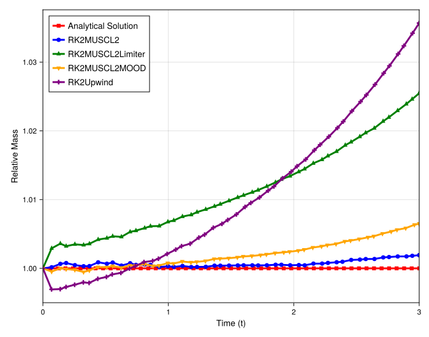
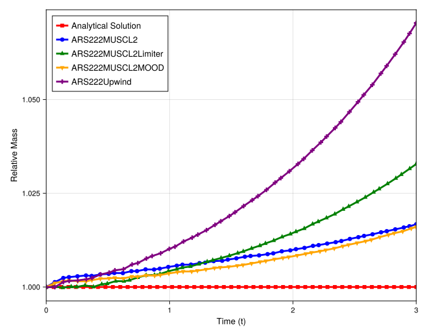

# Quantitative Analysis of Mass Conservation for Rarefaction Problem

## Introduction

This document provides a quantitative analysis of mass conservation for the 2D Burgers' rarefaction wave problem. It plots the **Relative Mass** (`M_num(t) / M_ana(t)`) over time. A value of **1.0 (the red horizontal line) signifies perfect mass conservation**.

This analysis complements the 1D cut, which showed that all high-resolution schemes were accurate and stable. Here, the goal is to quantify the mass change, which is expected to be dominated by numerical diffusion.

## Experimental Setup

The setup is identical to the 100x100 2D Burgers' rarefaction problem analyzed previously.
- **PDE**: 2D Burgers' (`burgers2d`)
- **Particles**: `Nx = 100`, `Ny = 100`
- **Grid**: Irregular (`randomness_factor = (0.2, 0.2)`)
- **Initial Condition**: Rarefaction Wave (`init_func = riemann`)
- **IC Parameters**: `(0.0, 1.0, (-3.0, -3.0), (1.0, 1.0))` (Step from 0 to 1)
- **Max Time (`tmax`)**: `10.0`

---

## Observation of Plots

All schemes show some deviation from the perfect 1.0 line, confirming they are not strictly conservative. The mass change (gain) correlates directly with the scheme's numerical diffusion.

### Direct (RK2) Solver Mass Conservation

- **`RK2Upwind`**: Shows the largest deviation. It starts with an initial mass *loss* (an artifact of its "classic" Rusanov algorithm) but then exhibits the **highest rate of mass gain**, consistent with it being the most diffusive scheme.
- **`RK2MUSCL2`**: Shows the **lowest mass gain**, staying closest to the 1.0 line. This reflects its status as the least diffusive, high-order base scheme.
- **`RK2MUSCL2Limiter` & `RK2MUSCL2MOOD`**: These schemes are grouped in between. They show slightly more mass gain than the pure `MUSCL2` scheme—reflecting the small amount of diffusion added by the limiting/MOOD process—but are significantly more conservative than `Upwind`.

### IMEX (ARS222) Solver Mass Conservation

- **`ARS222Upwind`**: Shows by far the **highest rate of mass gain**, consistent with it being the most diffusive scheme.
- **`ARS222MUSCL2`**: Again shows the **lowest mass gain** of all the schemes, staying closest to the 1.0 line.
- **`ARS222MUSCL2Limiter` & `ARS222MOOD`**: Are grouped in the middle. They add a small amount of diffusion compared to the base `MUSCL2` scheme, resulting in a slightly higher mass gain, but are still far superior to `Upwind`.

---

## Analysis

These plots confirm that the conservation errors for a smooth rarefaction wave are fundamentally different from those in the shock case.

1.  **Error is Dominated by Diffusion**: The mass change is clearly linked to diffusion. The schemes rank perfectly by their expected diffusivity: `Upwind` (most) > `Limiter`/`MOOD` (some) > `MUSCL2` (least).

2.  **IMEX Solver is Quantifiably More Diffusive**: As you hypothesized, the IMEX (`ARS222`) solver introduces slightly more numerical diffusion than the direct `RK2` solver. This is now quantified: the `ARS222` schemes *all* show a slightly higher mass gain than their `RK2` counterparts.

3.  **`MOOD` Behaves Well**: This analysis confirms that the `MOOD` scheme's conservation properties are excellent for smooth flows, performing as expected (slightly more diffusive than the base `MUSCL2` scheme). Its non-conservative pathology is strictly a shock-capturing failure.

4.  **Algorithmic Artifacts**: The `RK2Upwind`'s initial mass *loss* is a prime example of how specific low-level algorithmic choices (Classic Rusanov vs. Tiwari's, which is used in the IMEX Upwind) can introduce different conservation artifacts, even on the same problem.