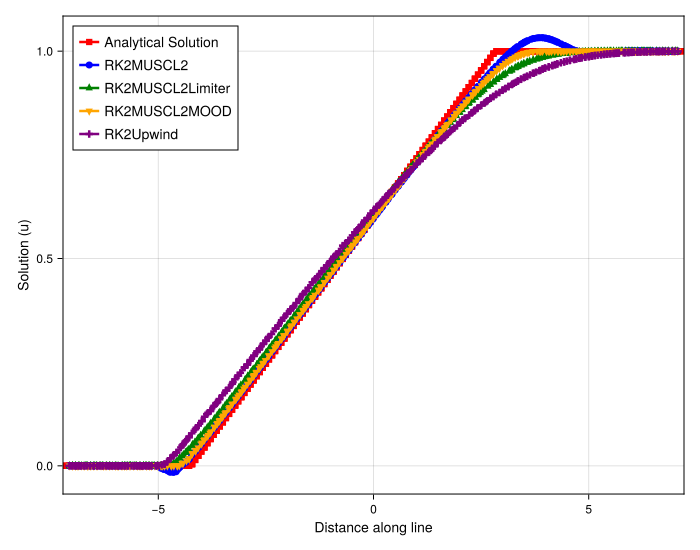
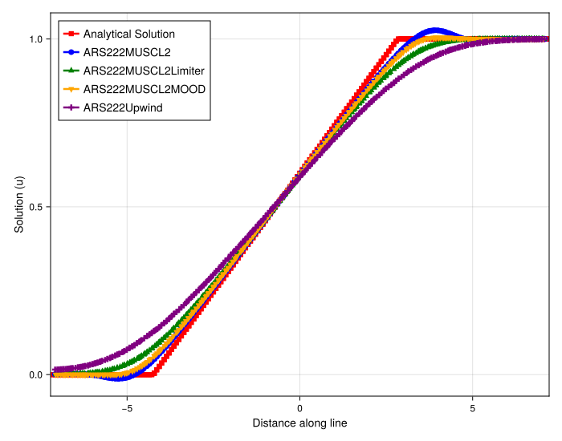

# Analysis of Direct vs. IMEX Solvers for 2D Burgers' Rarefaction

## Introduction

This document analyzes the results of a 2D inviscid Burgers' equation simulation, focusing on a diagonal rarefaction wave on an irregular grid. This analysis serves as a complement to the previous shock-capturing study. The primary goal is to assess the performance, stability, and accuracy of high-resolution meshfree schemes on a smooth, expanding flow.

## Experimental Setup

The simulation solves the 2D inviscid Burgers' equation. A 1D cut along the diagonal `(1,1)` direction is sampled for analysis. The key difference from the previous study is the initial condition, which now represents an expanding rarefaction wave.

### Shared Parameters
- **PDE**: 2D Burgers' (`burgers2d`)
- **Domain**: `[-5.0, 5.0]` x `[-5.0, 5.0]`
- **Particles**: `Nx = 100`, `Ny = 100`
- **Grid**: Irregular (`randomness_factor = (0.2, 0.2)`)
- **Initial Condition**: Rarefaction Wave (`init_func = riemann`)
- **IC Parameters**: `(0.0, 1.0, (-3.0, -3.0), (1.0, 1.0))` (Step from 0 to 1 along a diagonal)
- **Max Time (`tmax`)**: `10.0`

### Method-Specific Parameters

The experiment compares two solver families, differing only in their time-stepping integration.

1.  **Direct (RK2) Solver**:
    - **Timestepper**: `RalstonRK2`
    - **Schemes**: `RK2Upwind`, `RK2MUSCL2`, `RK2MUSCL2Limiter`, `RK2MUSCL2MOOD`

2.  **IMEX (ARS222) Solver**:
    - **Timestepper**: `ARS222` (a relaxation-based IMEX scheme)
    - **Schemes**: `ARS222Upwind`, `ARS222MUSCL2`, `ARS222MUSCL2Limiter`, `ARS222MOOD`

---

## Observation of Plots

### Direct (RK2) Solver Results

- **`RK2Upwind` (Purple)**: As expected, this first-order scheme is extremely diffusive, failing to capture the sharp corners of the rarefaction fan.
- **`RK2MUSCL2` (Blue)**: The unlimited second-order scheme is very accurate and, unlike the shock case, exhibits no oscillations on this smooth profile.
- **`RK2MUSCL2Limiter` (Green)**: The `VK` limiter provides a very accurate, sharp, and monotonic solution. It performs almost identically to the unlimited `MUSCL2` scheme, as the limiter is not aggressively triggered by the smooth flow.
- **`RK2MUSCL2MOOD` (Yellow)**: This scheme provides the sharpest (least diffusive) solution, capturing the rarefaction profile with the highest accuracy.

### IMEX (ARS222) Solver Results

- **`ARS222Upwind` (Purple)**: Again, highly diffusive.
- **`ARS222MUSCL2` (Blue)**: Very accurate and oscillation-free. It is *slightly* more diffusive than its `RK2` counterpart.
- **`ARS222MUSCL2Limiter` (Green)**: Provides an excellent, sharp solution, virtually indistinguishable from the `MUSCL2` and `MOOD` schemes.
- **`ARS222MOOD` (Yellow)**: Provides the sharpest result, closely followed by the `Limiter` and `MUSCL2` schemes.

---

## Analysis

The analysis of the rarefaction wave provides a crucial counterpoint to the shock study.

1.  **No Instabilities or Non-Conservation**: The most important finding is that *all* high-resolution methods (`MUSCL2`, `Limiter`, `MOOD`) are stable, non-oscillatory, and conservative for this smooth flow. This confirms that the catastrophic mass loss observed in the `MOOD` scheme is **exclusively a shock-capturing problem**.

2.  **MOOD Excels on Smooth Flow**: In the absence of shocks, the `MOOD` scheme delivers the best performance, producing the sharpest and most accurate solution. This is its ideal use-case.

3.  **Limiters as All-Rounders**: The `MUSCL2Limiter` scheme performs exceptionally well. While *fractionally* more diffusive than `MOOD` here, it proved to be the *only* scheme that was both robustly conservative for shocks and highly accurate for rarefactions, making it the most reliable all-around choice.

4.  **Time-Stepper Impact**: As you noted, the difference between time-steppers is minimal. The IMEX (`ARS222`) solver introduces a very slight, expected numerical diffusion compared to the direct `RK2` solver, but this does not impact the qualitative behavior or stability of any scheme.
