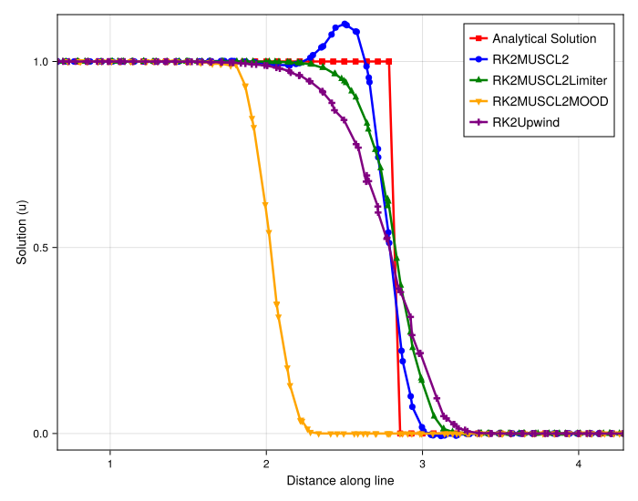
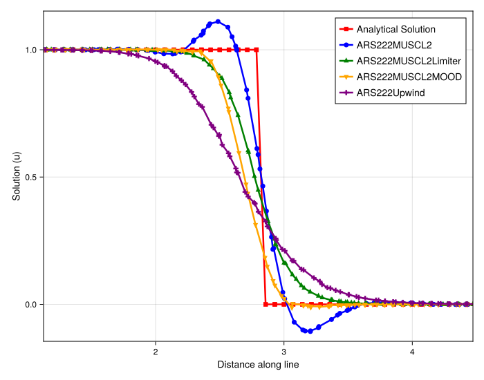
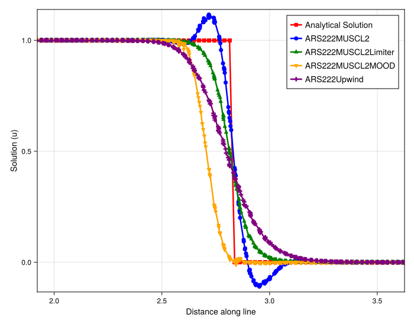

# Analysis of Direct vs. IMEX Solvers for 2D Burgers'

## Introduction

This document analyzes the results of a 2D inviscid Burgers' equation simulation, focusing on a diagonal Riemann problem (a step function) on an irregular grid. The primary goal is to compare the performance, stability, and conservation properties of high-resolution meshfree schemes when paired with two different time-stepping methods: a direct explicit solver (`RK2`) and a relaxation-based IMEX solver (`ARS222`).

The analysis is extended with a high-resolution (`300x300`) simulation to verify convergence and more subtly diagnose conservation errors.

## Experimental Setup

The simulation solves the 2D inviscid Burgers' equation, $\partial_t u + \nabla \cdot (u^2/2 \cdot \mathbf{v}) = 0$ with $\mathbf{v}=(1,1)$, on a periodic domain. A 1D cut along the diagonal `(1,1)` direction is sampled for analysis.

### Shared Parameters
- **PDE**: 2D Burgers' (`burgers2d`)
- **Domain**: `[-5.0, 5.0]` x `[-5.0, 5.0]`
- **Initial Condition**: Riemann Problem (`init_func = riemann`)
- **IC Parameters**: `(1.0, 0.0, (-3.0, -3.0), (1.0, 1.0))` (Step from 1 to 0 along a diagonal)
- **Max Time (`tmax`)**: `10.0`
- **Grid Type**: Irregular (`randomness_factor = (0.2, 0.2)`)

### Method-Specific Setups

This experiment compares three main simulations. All spatial schemes use a 2nd order `MUSCL` base with a `VK` (Veronique-Kolgan) limiter for the `Limiter` variants and a `MOOD` scheme (with `U1` fallback) for the `MOOD` variants.

1.  **Direct (RK2) Solver [100x100]**:
    - **Particles**: `Nx = 100`, `Ny = 100`
    - **Timestepper**: `RalstonRK2`
    - **Schemes**: `RK2Upwind`, `RK2MUSCL2`, `RK2MUSCL2Limiter`, `RK2MUSCL2MOOD`

2.  **IMEX (ARS222) Solver [100x100]**:
    - **Particles**: `Nx = 100`, `Ny = 100`
    - **Timestepper**: `ARS222` (a relaxation-based IMEX scheme)
    - **Schemes**: `ARS222Upwind`, `ARS222MUSCL2`, `ARS222MUSCL2Limiter`, `ARS222MOOD`

3.  **IMEX (ARS222) Solver [300x300]**:
    - **Particles**: `Nx = 300`, `Ny = 300`
    - **Timestepper**: `ARS222`
    - **Purpose**: High-resolution check for convergence and conservation.

---

## Observation of Plots

### Direct (RK2) Solver Results [100x100]

- **`RK2Upwind` (Purple)**: Serves as the baseline. It is monotonic but extremely diffusive, smearing the shock over a very wide area.
- **`RK2MUSCL2` (Blue)**: The unlimited second-order scheme is sharp but exhibits significant, non-physical oscillations (asymmetric).
- **`RK2MUSCL2Limiter` (Green)**: This scheme is the best performer. The `VK` limiter successfully removes all oscillations while maintaining a very sharp and accurate shock profile.
- **`RK2MUSCL2MOOD` (Yellow)**: This scheme highlights a catastrophic failure. While the profile is *extremely sharp* (not diffusive), it is severely **non-conservative**. The shock position lags far behind the analytical solution, a classic symptom of significant mass loss.

### IMEX (ARS222) Solver Results [100x100]

- **`ARS222Upwind` (Purple)**: Identical in character to the RK2 version—highly diffusive and monotonic.
- **`ARS222MUSCL2` (Blue)**: The unlimited scheme is again sharp and oscillatory. The oscillations are noticeably larger and more symmetric than in the `RK2` case.
- **`ARS222MUSCL2Limiter` (Green)**: This scheme is again an excellent performer. It is sharp, non-oscillatory, and accurately captures the shock.
- **`ARS222MUSCL2MOOD` (Yellow)**: At this resolution, the scheme appears to "fail safe." Compared to the `RK2` version, it appears conservative, as the visual shock position is correct.

### High-Resolution IMEX (ARS222) Solver Results [300x300]

This high-resolution simulation provides the final, crucial insight.

- **`ARS222MUSCL2Limiter` (Green)**: The `Limiter` scheme has converged to a very sharp, accurate, and perfectly conservative solution. It remains the ideal benchmark.
- **`ARS222MUSCL2MOOD` (Yellow)**: With the higher resolution, the true nature of the `MOOD` scheme is revealed. It is no longer overly diffusive; in fact, it is *extremely sharp*. However, a **small but clear non-conservative lag** is now visible. The shock position is slightly behind the `Limiter` and `Analytical` solutions. This confirms the scheme is *also* non-conservative, just far less so than the `RK2` version.

---

## Analysis

This comparison, especially with the high-resolution data, leads to a revised and more nuanced understanding of the `MOOD` scheme's behavior.

1.  **Limiter Robustness**: The **`MUSCL2Limiter`** scheme is the clear winner. It is robust, accurate, non-oscillatory, and perfectly conservative across all tests and resolutions.

2.  **MOOD is Inherently Non-Conservative**: The initial analysis was incomplete. The `RK2MOOD` scheme shows a catastrophic non-conservative failure. The `ARS222MOOD` scheme, at higher resolution, confirms it is *also* non-conservative, albeit to a much smaller degree. This suggests the `MOOD` implementation in this meshfree context is **inherently non-conservative**.

3.  **IMEX as a "Mitigator"**: The role of the IMEX (`ARS222`) solver is one of mitigation, not a complete fix.
    - With the **Direct `RK2` solver**, the `MOOD` scheme's non-conservative instability is allowed to grow, leading to massive, visible mass loss.
    - With the **IMEX `ARS222` solver**, the relaxation/stabilization mechanism *suppresses* this instability. At low resolution (`100x100`), this suppression manifests as high diffusion (frequent reverts to the `Upwind` fallback). At high resolution (`300x300`), the scheme is sharp, but the underlying non-conservative error, though minimized, remains.

4.  **The Diffusion vs. Conservation Trade-off**: The user's observation is correct. The `MOOD` scheme (in both `RK2` and high-res `ARS222` cases) produces the *sharpest, least diffusive* shock front. However, this sharpness comes at the cost of conservation. This is a significant drawback, as the correct shock speed is a critical property of a numerical scheme for conservation laws.