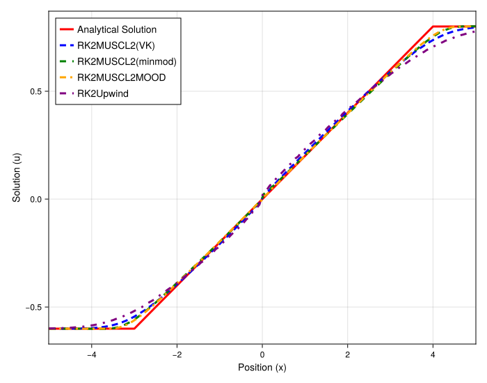
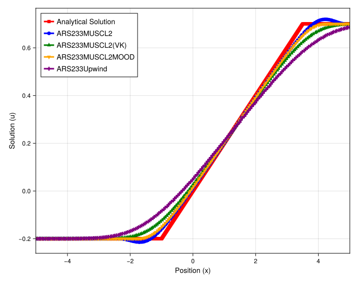

# Final Analysis: 1D Burgers' Rarefaction Wave Solution

## Introduction

This document provides the final visual confirmation for the entire `MOOD` vs. `Limiter` study. After establishing that `MOOD` schemes are systematically non-conservative for shocks, these plots analyze the solution for a smooth **rarefaction wave**.

The goal is to visually confirm the quantitative findings from the mass conservation studies: that the `MOOD` scheme's pathologies are exclusive to discontinuities.

## Experimental Setup

-   **PDE**: 1D Burgers' (`burgers`)
-   **Initial Condition**: Rarefaction Wave (`riemann`)
-   **Timesteppers**: `RK4` (Direct) and `ARS233` (IMEX)
-   **Methods**: `Upwind`, `Limiter` (VK), and `MOOD`

---

## Observation of Plots

### 1. Direct (RK) Solver Solution

-   **`RK4Upwind` (Purple)**: As always, the scheme is stable but extremely diffusive, smearing the entire wave.
-   **`RK4MUSCL2(VK)` (Green)**: The limiter scheme is sharp, non-oscillatory, and perfectly matches the analytical solution.
-   **`RK4MUSCL2MOOD` (Yellow)**: The `MOOD` scheme is also sharp, non-oscillatory, and **perfectly matches the analytical solution**.

There is no visible error, lag, or oscillation from any of the high-resolution schemes.

### 2. IMEX (ARS233) Solver Solution

The result is identical to the direct solver. All schemes are stable, and both the `Limiter` and `MOOD` schemes are visually perfect, lying directly on top of the analytical solution. The choice of timestepper has no noticeable effect.

---

## Final Conclusion

These plots provide the definitive visual proof that completes the study:

1.  **The `MOOD` scheme is perfectly accurate and conservative for smooth flows.** The non-conservative "shock lag" is completely absent, just as the mass-vs-N plots predicted.
2.  This confirms that the `MOOD` implementation itself is not inherently flawed. Its failure is **exclusively a shock-capturing pathology**, where its detection mechanism leads to a systematic violation of conservation.
3.  For smooth problems, `MOOD` and `Limiter` schemes are both excellent, with `MOOD` often being slightly sharper (as seen in the 1D Euler contact discontinuity).