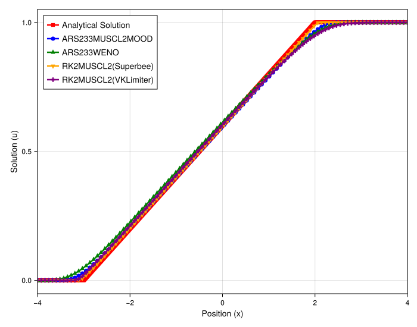
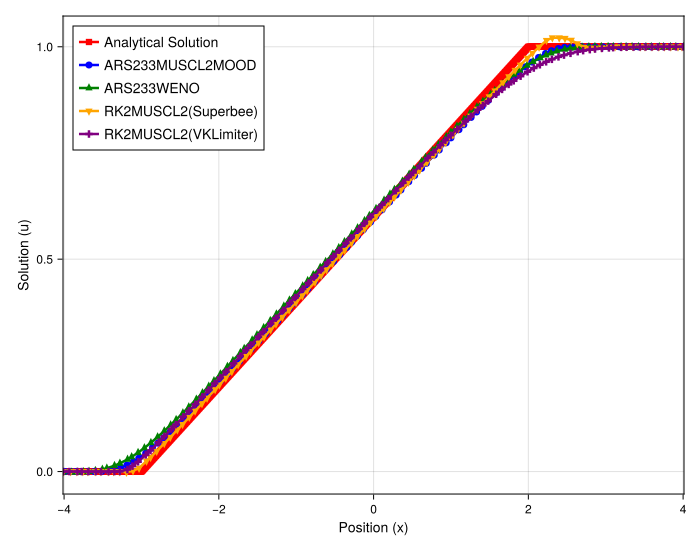

# Analysis of Scheme Performance for a Burgers' Rarefaction Wave

## Introduction

This experiment evaluates the performance of the high-resolution meshfree schemes on a smooth, expanding solution profile—a rarefaction wave—for the inviscid Burgers' equation. In contrast to the previous shock-capturing tests, this case assesses the ability of the methods to accurately resolve evolving smooth gradients without introducing numerical artifacts like oscillations or excessive diffusion. The test is conducted on both uniform and irregular grids to check for robustness.

## Experimental Setup

The simulation solves the 1D inviscid Burgers' equation, $\partial_t u + \partial_x (u^2/2) = 0$, on a periodic domain. The initial condition is a step function that evolves into a smooth, expanding rarefaction wave.

### Shared Parameters
- **PDE**: Burgers' Equation
- **Initial Condition**: Rarefaction
- **Domain**: `[-4, 4]` (periodic)
- **Particles (`N`)**: 100
- **Final Time (`tmax`)**: 5.0
- **Timestepper**: `ARS233` (IMEX)
- **Methods Tested**: `MUSCL-Superbee`, `MUSCL-VK`, `MOOD`, `WENO`

---

## Observation of Plots

### Uniform Grid

On the uniform grid, the performance of all tested methods is excellent and nearly indistinguishable.
- **All Schemes**: The `MUSCL-Superbee`, `MUSCL-VK`, `MOOD`, and `WENO` solutions are all visually identical and lie directly on top of the analytical solution. The rarefaction wave is captured smoothly and accurately with no visible oscillations or other numerical errors.

### Irregular Grid

On the irregular grid, a clear distinction in performance emerges.
- **`MUSCL-VK`, `MOOD`, `WENO`**: These three schemes continue to perform exceptionally well. Their solutions remain smooth, non-oscillatory, and closely track the analytical profile, demonstrating their robustness to grid perturbations.
- **`MUSCL-Superbee`**: This scheme now produces a noticeable overshoot at the top "corner" of the rarefaction wave, where the gradient changes most rapidly. The rest of the profile, however, remains accurate.

---

## Analysis

The results show that while most of the high-resolution schemes handle smooth profiles robustly, the `MUSCL-Superbee` limiter exhibits a clear sensitivity to grid irregularity.

- **General Performance on Smooth Flow**: The excellent performance of all schemes on the uniform grid is expected. A rarefaction wave is a continuous, expanding solution, which lacks the sharp discontinuities that challenge shock-capturing schemes. The underlying high-order reconstructions of all tested methods are well-suited for resolving such smooth profiles without difficulty.

- **Instability of Superbee on Irregular Grids**: The overshoot from the `MUSCL-Superbee` limiter on the irregular grid is the key finding. This behavior is consistent with the instabilities observed in the linear advection case. The Superbee limiter is known to be highly compressive (anti-diffusive) and can be aggressive in sharpening profiles. Its formulation relies on a precise ratio of one-sided gradients. On an irregular grid, the inconsistent particle spacing makes this ratio unreliable. At the "corner" of the rarefaction, where the gradient changes sharply, this unreliability causes the limiter to apply an incorrect, overly compressive correction, resulting in the non-physical overshoot.

- **Robustness of Other Schemes**: The `MOOD`, `WENO`, and `MUSCL-VK` schemes prove robust to the grid irregularity. The `MOOD` and `WENO` schemes have more sophisticated, adaptive mechanisms for handling gradients that are less susceptible to simple geometric perturbations. The `MUSCL-VK` limiter, being a geometric bound-based limiter rather than a ratio-based one, is also inherently more stable on irregular grids, as its logic does not depend on a precise ratio of neighboring slopes. This confirms their suitability for complex problems on non-uniform point distributions.