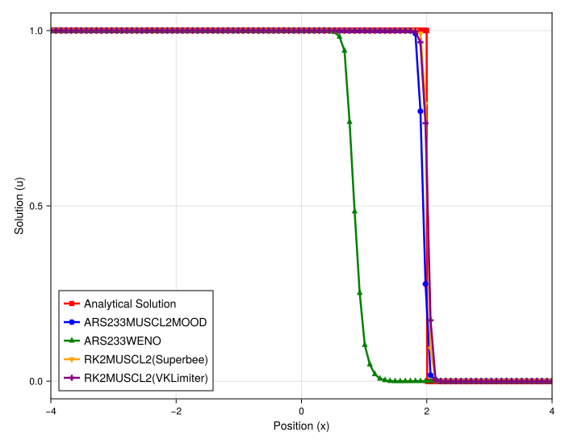
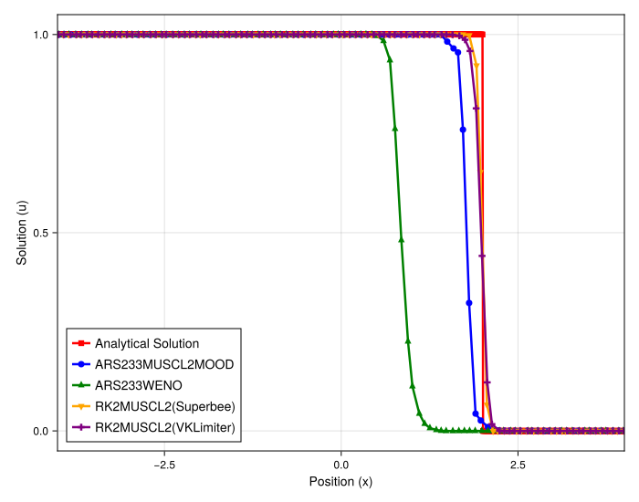
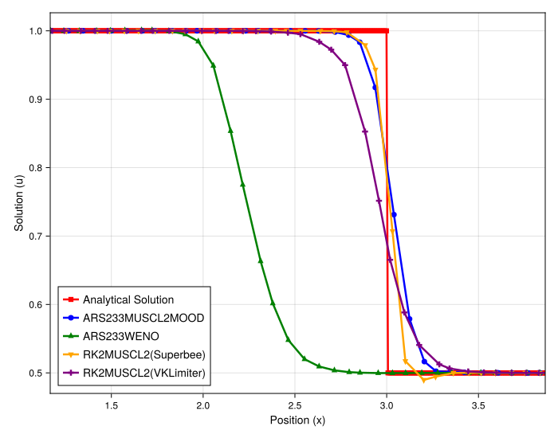

# Analysis of Mass Conservation for the Burgers' Equation

## Introduction

This experiment investigates a critical aspect of numerical schemes for conservation laws: the preservation of conserved quantities, such as mass or momentum. Using the inviscid Burgers' equation, we simulate the propagation and steepening of a profile into a shock. The primary goal is to diagnose and analyze mass loss observed in certain meshfree high-resolution schemes. The test is run with different initial conditions and on both uniform and irregular grids to isolate the cause of the non-conservative behavior.

## Experimental Setup

The simulation solves the 1D inviscid Burgers' equation, $\partial_t u + \partial_x (u^2/2) = 0$, on a periodic domain. Three scenarios are considered: a step function from 1 to 0 on both uniform and irregular grids, and a step function from 1 to 0.5 on a uniform grid.

### Shared Parameters
- **PDE**: Burgers' Equation
- **Domain**: `[-4, 4]` (periodic)
- **Particles (`N`)**: 100
- **Grid (Scenarios 1 & 2)**: Uniform and Irregular (`randomness_factor = 0.2`)
- **Grid (Scenario 3)**: Uniform
- **Timestepper**: `ARS233` (IMEX)
- **Spatial Scheme Base**: 2nd order `MUSCL` (linear reconstruction)

### Method-Specific Parameters and Initial Conditions

1.  **Shock (1 to 0)**: `init_func = box`, `tmax = 0.5`
    - `MUSCL-Superbee`: `limiter = superbee`
    - `MUSCL-VK`: `limiter = VK`
    - `MOOD`: `fallback_gradient = Upwind`, `MOOD = U1`
    - `WENO`: `main_gradient = WENO`, `order = 2`

2.  **Small Step (1 to 0.5)**: `init_func = step`, `init_params = [1.0, 0.5]`, `tmax = 1.0`
    - `MOOD`: `fallback_gradient = Upwind`, `MOOD = U1`
    - `WENO`: `main_gradient = WENO`, `order = 2`

---

## Observation of Plots

### Shock Profile (1 to 0)

In both the uniform and irregular grid simulations, a clear pattern of mass loss emerges for specific methods.
- **`MUSCL-Superbee` & `MUSCL-VK`**: These limiter-based schemes perform very well. They accurately capture the shock speed and strength, and the area under the curve (representing the total mass) appears well-preserved. The solutions are sharp and non-oscillatory.
- **`MOOD` & `WENO`**: Both of these methods exhibit significant and visually obvious mass loss. While the height of the profile is correct, the shock position appears to lag behind, which is a classic symptom of incorrect shock speed due to non-conservation. The effect is present on both uniform and irregular grids.

### Small Step Profile (1 to 0.5)

This scenario tests the `MOOD` and `WENO` schemes with an initial condition that does not go down to zero.
- **`MOOD` & `WENO`**: In this case, the mass loss is substantially reduced. While there might be some minor dissipation, the severe loss of mass seen in the 1-to-0 shock case is no longer apparent. The solutions largely maintain their profile height.

---

## Analysis

The results indicate that the mass loss is not an inherent flaw of the meshfree method itself, but rather a specific consequence of the formulation of the `MOOD` and `WENO` schemes, particularly when dealing with regions of near-zero solution values.

- **Conservation in Meshfree Methods**: Finite volume methods are conservative by construction because they evolve cell averages based on fluxes at cell interfaces. This telescope sum property guarantees that the total mass is preserved. The implemented meshfree method, however, is a point-collocation or finite-difference-like scheme that approximates the divergence operator at each particle. It does not inherently enforce a strict conservation property.

- **Source of Mass Loss in MOOD/WENO**: The `MUSCL-Superbee` and `MUSCL-VK` limiters successfully conserve mass, demonstrating that the underlying divergence approximation can be non-dissipative. The issue with `MOOD` and `WENO` likely stems from how they handle the state near the shock.
    - **MOOD**: The MOOD scheme operates by replacing the high-order update with a robust, first-order upwind update when a physical violation is detected. This first-order update is known to be dissipative. In the 1-to-0 shock case, the shock moves into a region where the solution is zero. The dissipative fallback at the shock front clips the solution profile, and because the value ahead of it is zero, this clipped mass is not compensated for elsewhere, leading to a net loss.
    - **WENO**: Similarly, the WENO scheme uses non-linear weights that effectively blend stencils. At a strong shock, the scheme also introduces dissipation to maintain stability. When this dissipation acts at the foot of the shock where the solution is zero, it can lead to a similar clipping effect and loss of total mass.

- **The "Zero Value" Problem**: The "Small Step" experiment is the key diagnostic. By changing the downstream state from 0 to 0.5, the dissipative effects at the shock front no longer entirely remove mass from the system but rather average it with a non-zero value. This significantly lessens the net mass loss, confirming that the interaction of the scheme's numerical dissipation with the zero-valued region is the primary cause of the non-conservative behavior, rather than the step size itself. The use of IMEX schemes, while not the focus here, likely helps mitigate this by providing a more stable time integration that may reduce the severity of the dissipation required by MOOD/WENO at each stage, thus lessening the mass loss.