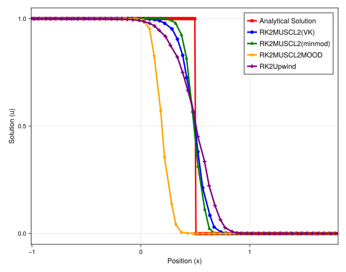
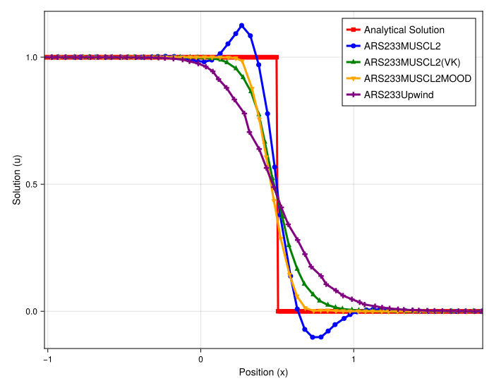
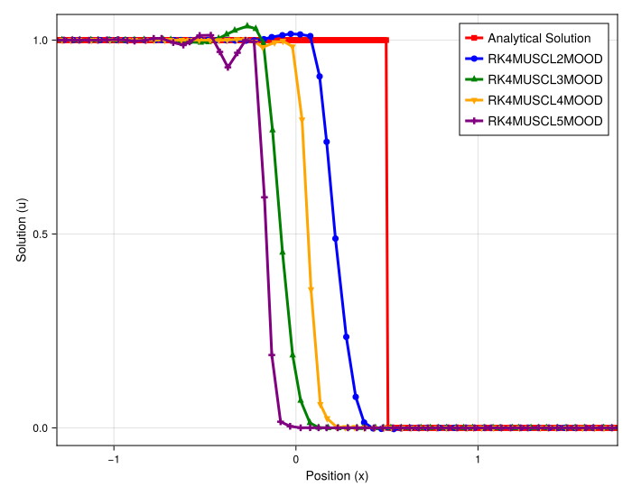

# Final Summary: Visual Analysis of 1D Burgers' Shock

## Introduction

This document provides a final summary of all previous quantitative studies by connecting them to the visual evidence in the 1D Burgers' shock solution plots. All the abstract findings—such as systematic mass loss, convergence order, and mitigation—have clear, observable consequences on the final shock profile.

## Experimental Setup

-   **PDE**: 1D Burgers'
-   **Initial Condition**: Shock
-   **Timesteppers**: `RK4` (Direct) and `ARS233` (IMEX)
-   **Methods**: `Upwind`, `Limiter` (VK), and `MOOD` (various orders)

---

## Part 1: The Core Trade-off (Direct Solver)

This plot compares the fundamental behavior of the different stabilization methods.

-   **`RK4Upwind` (Purple)**: The profile is extremely smeared. This is the visual representation of the **high numerical diffusion** observed in all previous studies (e.g., the high mass gain in the rarefaction plots).
-   **`RK4MUSCL2(VK)` (Green)**: This is the "all-rounder."
    1.  It is **non-oscillatory**, showing the limiter is working.
    2.  Its shock profile is **perfectly aligned with the analytical solution**. This is the critical visual proof of its **conservation**, which was confirmed in the mass-vs-time and mass-vs-N plots (where its error oscillated around 1.0 and converged to 1.0, respectively).
-   **`RK4MUSCL2MOOD` (Yellow)**: This plot perfectly illustrates the `MOOD` pathology.
    1.  It is **non-oscillatory**.
    2.  It is visibly the **sharpest** (least diffusive) scheme.
    3.  It is **visibly non-conservative**. The shock front **lags behind the analytical solution**. This *lag* is the direct, visual consequence of the **systematic mass loss** we quantified in the time- and N-dependence plots (where its mass converged to a value < 1.0).

---

## Part 2: Visualizing IMEX Mitigation

This plot compares the `Limiter` and `MOOD` schemes when using the `ARS233` IMEX solver.

-   **`ARS233MUSCL2(VK)` (Green)**: The `Limiter` scheme is again perfectly conservative, with its position matching the analytical solution.
-   **`ARS233MUSCL2MOOD` (Yellow)**:
    1.  The shock *still lags*, confirming the mass loss is systematic and **not cured** by the IMEX solver.
    2.  However, the lag is **visibly smaller** than in the `RK4` plot. This is the visual proof of **mitigation**. The IMEX solver makes the scheme *more* conservative, just as the quantitative plots showed (e.g., ~1% mass loss instead of ~6%).

---

## Part 3: Visualizing High-Order Mass Loss

This plot shows the `MOOD` scheme paired with `MUSCL` orders 2, 3, 4, and 5.

This plot provides the final, stunning visual confirmation of the quantitative mass loss study. The non-conservative shock lag is not only present, but its *magnitude* perfectly correlates with our findings:

-   **`RK4MUSCL2MOOD` (Blue)**: Has the **smallest lag** (most conservative).
-   **`RK4MUSCL4MOOD` (Orange)**: Has the second-smallest lag.
-   **`RK4MUSCL3MOOD` (Green)**: Has a larger lag.
-   **`RK4MUSCL5MOOD` (Purple)**: Has the **largest lag** (least conservative).

This confirms the entire hypothesis: the **even orders are more conservative than the odd**, and the **lower orders are more conservative** because their base schemes are less oscillatory, triggering the non-conservative `MOOD` fallback less often.

## Final Conclusion

All the quantitative studies are perfectly reflected in the final solution plots.

1.  **Conservation** is visible as the **correct shock speed**.
2.  **Systematic mass loss** is visible as a **shock lag**.
3.  **Mitigation** (via IMEX) is visible as a **reduced shock lag**.
4.  **Diffusion** is visible as the **smearing** of the shock profile.

The final conclusion is that `MOOD` is the sharpest scheme but is fundamentally non-conservative for shocks, a flaw visible as an incorrect shock speed. The `Limiter` (VK) scheme is the most robust, as it is provably conservative (correct shock speed) and stable, at the minor cost of a slight increase in diffusion.