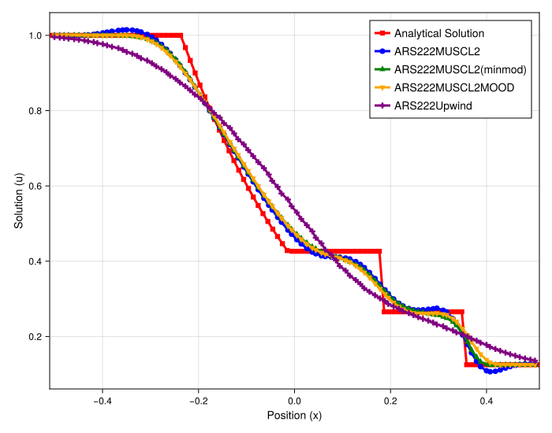
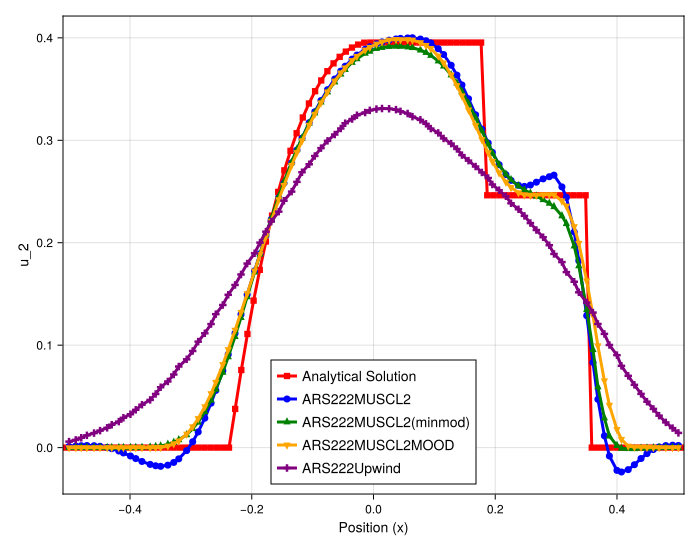
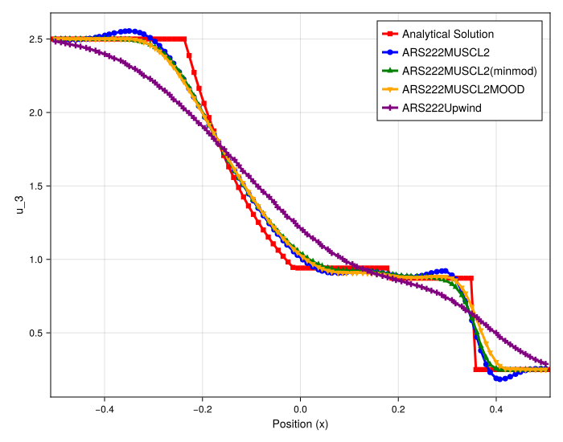
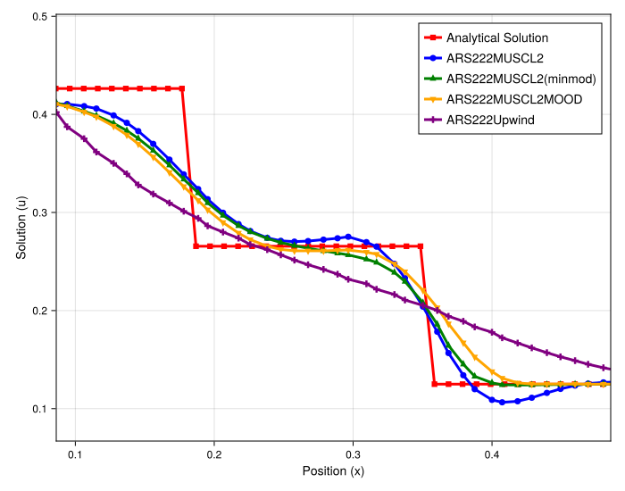
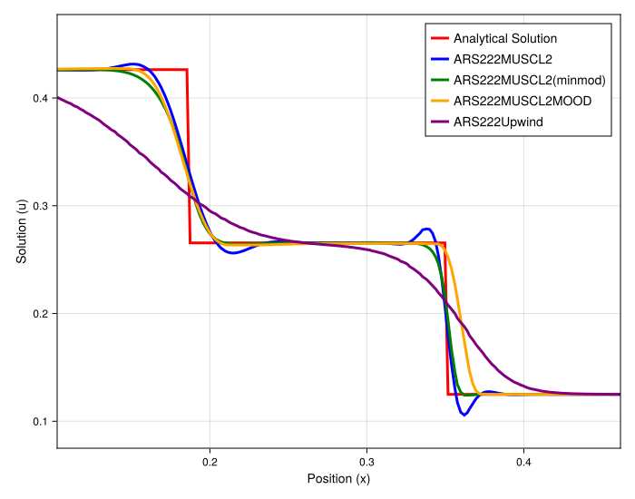

# 1D Euler Riemann Problem Analysis

## Introduction

This document analyzes the performance of various high-order MUSCL-type schemes on a 1D Euler Riemann problem. The goal is to compare the methods based on their stability (oscillations), diffusion, and conservation properties (especially shock speed).

The solution to this problem consists of three waves (from left to right): a **rarefaction**, a **contact discontinuity**, and a **shock**.

## Experimental Setup

-   **PDE**: 1D Euler (`euler1d`)
-   **Initial Condition**: Riemann Problem (`eulerShockTube`)
-   **Methods Compared**:
    -   `Analytical Solution`
    -   `Upwind` (First-order)
    -   `MUSCL` (Unlimited, 2nd-order)
    -   `MUSCL_Limiter` (With slope limiter)
    -   `MUSCL_MOOD` (With MOOD stabilization)

---

## Observation of Full Plots

-   **`Upwind` (Purple)**: As expected, this first-order scheme is extremely diffusive. It is stable and non-oscillatory, but it smears all three waves (rarefaction, contact, and shock) to the point where they are barely recognizable.
-   **`MUSCL` (Blue)**: The unlimited second-order scheme is very sharp but suffers from severe, non-physical oscillations (Gibbs phenomenon) at both the contact discontinuity and the shock.
-   **`MUSCL_Limiter` (Green)**: This scheme successfully eliminates the oscillations from the `MUSCL` scheme. It provides a sharp, stable, and clean profile for all three waves.
-   **`MUSCL_MOOD` (Yellow)**: This scheme is also non-oscillatory and appears to be the **sharpest** of all methods, particularly at the contact discontinuity.

---

## Detailed Analysis (Shock & Contact)

This is where the critical differences between `MOOD` and the `Limiter` become clear.

1.  **Rarefaction and Contact (Zoomed View)**:
    -   The `MOOD` scheme (yellow) is visibly the sharpest, capturing the contact discontinuity with the least diffusion.
    -   The `Limiter` scheme (green) is nearly as accurate, providing a very high-resolution capture of both waves, just slightly more diffusive than `MOOD`.

2.  **Shock Speed (High-Resolution Zoom)**:
    -   This is the most important finding. The high-resolution zoom (`euler_solution_zoom_highRes.svg`) clearly shows that the **`MOOD` scheme (yellow) is non-conservative**. Its shock front *lags* significantly behind the analytical solution.
    -   The **`MUSCL_Limiter` (green) scheme correctly captures the shock speed**. Its profile lies perfectly on top of the analytical solution. This confirms it is nearly conservative scheme.

---

## Conclusion

The analysis, which is consistent with the Burgers' case, shows a clear trade-off:

-   **`Upwind`**: Too diffusive for practical use.
-   **`MUSCL`**: Too oscillatory for practical use.
-   **`MUSCL_MOOD`**: Achieves the *highest sharpness* (best for rarefactions and contacts) but **fails on conservation**, leading to an incorrect shock speed. This makes it unsuitable for problems where shock position is critical.
-   **`MUSCL_Limiter`**: Represents the best overall compromise. It is **non-oscillatory**, **nearly conservative** (capturing the correct shock speed), and **highly accurate** (nearly as sharp as MOOD).