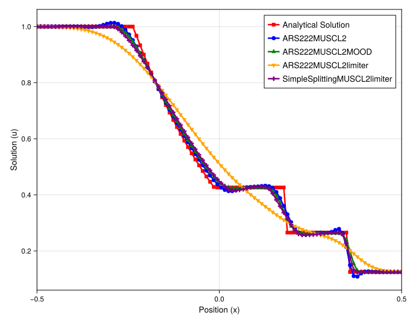
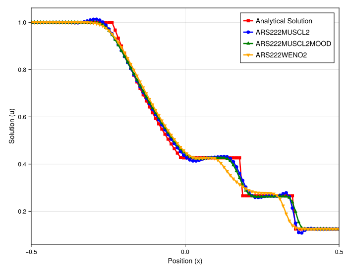

### Numerical Experiment: Scheme Performance for the Euler Shock Tube (Uniform Grid)

This experiment evaluates the performance of various high-order relaxation schemes and stabilization techniques when applied to the 1D Euler equations on a uniform grid. The initial condition is a Riemann problem (the Sod shock tube), which evolves into a complex structure containing a left-moving rarefaction wave, a contact discontinuity, and a right-moving shock wave. Using a uniform grid removes any errors associated with grid irregularity and allows for a clean comparison of each scheme's fundamental accuracy and diffusion/dispersion properties.

#### Experimental Setup

The test problem is the 1D Euler equations, solved using a relaxation framework. The initial condition is the classic Sod shock tube. The simulation is run on a uniform grid (`randomness_factor = 0.0`), and the plots show the density profile ($\rho$) at a fixed final time.

#### Rationale for Method Selection

The study is separated into two comparisons to clearly evaluate different aspects of the numerical schemes under ideal grid conditions:
1.  **Limiter vs. MOOD:** This compares a standard MUSCL scheme with a slope limiter against a MOOD-stabilized MUSCL scheme. It also critically compares two different time-stepping strategies for the limited scheme: a fully-coupled IMEX method (`ARS222`) and a first-order operator splitting method (`SimpleSplitting`).
2.  **WENO vs. MOOD:** This compares the performance of the MOOD-stabilized MUSCL scheme against a higher-order WENO reconstruction to see which approach better resolves the complex wave structure.

#### Observations and Analysis

##### Comparison 1: Slope Limiters and Time Integration Strategy

This figure compares the performance of a slope-limited MUSCL scheme using two different time integrators against the MOOD-stabilized version.

* **Observation:** The results are consistent with those on the irregular grid. The `ARS222MUSCL2limiter` (green line) is extremely diffusive, smearing out the contact discontinuity and the shock wave. In stark contrast, the `SimpleSplittingMUSCL2limiter` (orange line) is significantly more accurate, capturing all three wave features with impressive sharpness, performing almost identically to the `ARS222MUSCL2MOOD` scheme (blue line). The unlimited `ARS222MUSCL2` (purple line) shows large oscillations, confirming the need for stabilization.

* **Analysis:** This result confirms that the excessive diffusion of the `ARS222` limiter scheme is not an artifact of the irregular grid but is a fundamental property of the time integration strategy. The "implicit-first" nature of the ARS scheme, where relaxation is handled before the explicit advection, feeds a smoothed profile to the limiter, leading to a highly diffused final solution. The `SimpleSplitting` method's "explicit-first" approach preserves the sharpness of the limiter and is clearly superior for this type of stabilization.

##### Comparison 2: MOOD vs. WENO Reconstruction

This figure compares the performance of the MOOD-stabilized MUSCL scheme against a WENO reconstruction.

* **Observation:** The `ARS222MUSCL2MOOD` scheme (blue line) successfully captures all three features: the smooth rarefaction, the sharp contact discontinuity, and the shock wave. It exhibits some minor, well-controlled post-shock oscillations. The `ARS222WENO2` scheme (orange line), while capturing the main shock and rarefaction, is noticeably more diffusive and **fails to correctly capture the contact discontinuity**, smearing it into a smooth profile. The unlimited `ARS222MUSCL2` (green line) is again shown to be unstable.

* **Analysis:** For this complex problem, the MOOD framework proves to be superior to the WENO reconstruction, even on a uniform grid. The MOOD scheme's ability to apply a robust first-order method locally and only when needed allows it to maintain sharpness across all discontinuities. The WENO scheme, while high-order, appears to introduce too much numerical diffusion in this context, particularly struggling with the subtle but sharp contact discontinuity.

#### Conclusion

This series of experiments on the Euler shock tube problem on a uniform grid provides two key conclusions that are consistent with the irregular grid results:

1.  When using relaxation schemes with classical slope limiters, an **explicit-first operator splitting approach (`SimpleSplitting`) is vastly superior** to interwoven IMEX methods (`ARS222`). The latter introduces excessive diffusion by applying the limiter to an already-relaxed, smooth state.
2.  For capturing complex wave structures with multiple discontinuities, the **`MUSCL+MOOD` framework is more effective than the tested `WENO` scheme**. The MOOD approach provides a better balance of sharpness and stability, successfully resolving the shock, contact, and rarefaction waves, while the WENO scheme suffers from excessive diffusion at the contact discontinuity.