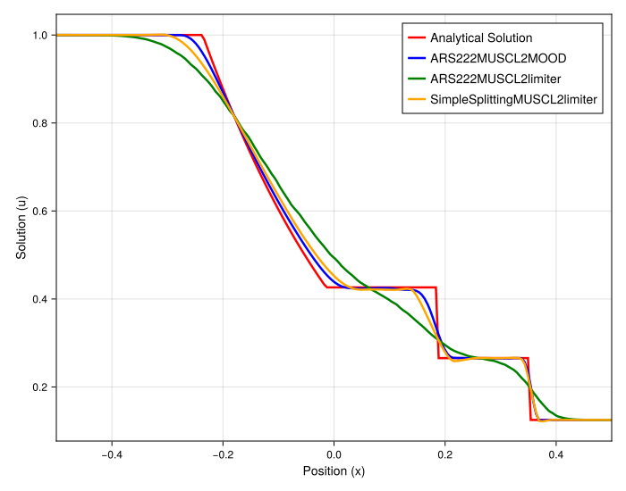
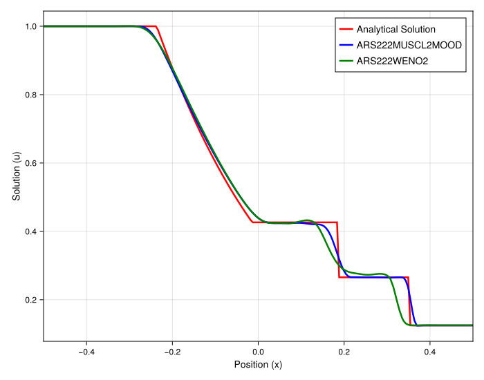

### Numerical Experiment: Scheme Performance for the Euler Shock Tube

This experiment evaluates the performance of various high-order relaxation schemes and stabilization techniques when applied to the 1D Euler equations. The initial condition is a Riemann problem (the Sod shock tube), which evolves into a complex structure containing a left-moving rarefaction wave, a contact discontinuity, and a right-moving shock wave. The goal is to assess each method's ability to accurately capture all three of these distinct physical phenomena.

#### Experimental Setup

The test problem is the 1D Euler equations, solved using a relaxation framework. The initial condition is the classic Sod shock tube, which has a high-pressure, high-density state on the left and a low-pressure, low-density state on the right. The simulation is run on an irregular grid to test the robustness of the meshfree methods. The plots show the density profile ($\rho$) at a fixed final time.

#### Rationale for Method Selection

The study is separated into two comparisons to clearly evaluate different aspects of the numerical schemes:
1.  **Limiter vs. MOOD:** This compares a standard MUSCL scheme with a slope limiter against a MOOD-stabilized MUSCL scheme. It also critically compares two different time-stepping strategies for the limited scheme: a fully-coupled IMEX method (`ARS222`) and a first-order operator splitting method (`SimpleSplitting`).
2.  **WENO vs. MOOD:** This compares the performance of the MOOD-stabilized MUSCL scheme against a higher-order WENO reconstruction to see which approach better resolves the complex wave structure.

#### Observations and Analysis

##### Comparison 1: Slope Limiters and Time Integration Strategy

This figure compares the performance of a slope-limited MUSCL scheme using two different time integrators against the MOOD-stabilized version.

* **Observation:** The `ARS222MUSCL2limiter` (green line) is extremely diffusive. It smears out the contact discontinuity and the shock wave to such an extent that they are barely recognizable, performing much worse than the other methods. In stark contrast, the `SimpleSplittingMUSCL2limiter` (orange line) is significantly more accurate, capturing all three wave features with impressive sharpness. The `ARS222MUSCL2MOOD` scheme (blue line) provides a high-quality solution that is comparable to the `SimpleSplitting` result.

* **Analysis:** This result highlights a crucial finding regarding the interaction of limiters and IMEX time integration. The poor performance of the `ARS222` limiter scheme is due to its "implicit-first" nature within each stage. The implicit relaxation step, which is diffusive, acts on the data *before* the explicit advection step with the limiter is calculated. This feeds already-smeared data to the limiter, resulting in a highly diffused final solution. The `SimpleSplitting` method, however, is "explicit-first." It performs the entire explicit, limited advection step on the sharp data *first*, and only then applies the implicit relaxation. This preserves the sharpness of the limiter and leads to a much more accurate result, consistent with observations from the linear advection case.

##### Comparison 2: MOOD vs. WENO Reconstruction

This figure compares the performance of the MOOD-stabilized MUSCL scheme against a WENO reconstruction, both using the same `ARS222` IMEX timestepper.

* **Observation:** The `ARS222MUSCL2MOOD` scheme (blue line) successfully captures all three features: the smooth rarefaction, the sharp contact discontinuity, and the shock wave, though it exhibits some minor post-shock oscillations. The `ARS222WENO2` scheme (green line), while capturing the main shock and rarefaction, is noticeably more diffusive and **fails to correctly capture the contact discontinuity**, smearing it into a smooth profile.

* **Analysis:** For this complex problem, the MOOD framework proves to be superior to the WENO reconstruction. The MOOD scheme's ability to apply a robust first-order method locally and only when needed allows it to maintain sharpness across all discontinuities. The WENO scheme, while high-order, appears to introduce too much numerical diffusion in this context, particularly struggling with the subtle but sharp contact discontinuity.

#### Conclusion

This series of experiments on the Euler shock tube problem provides two key conclusions:

1.  When using relaxation schemes with classical slope limiters, an **explicit-first operator splitting approach (`SimpleSplitting`) is vastly superior** to interwoven IMEX methods (`ARS222`). The latter introduces excessive diffusion by applying the limiter to an already-relaxed, smooth state.
2.  For capturing complex wave structures with multiple discontinuities, the **`MUSCL+MOOD` framework is more effective than the tested `WENO` scheme**. The MOOD approach provides a better balance of sharpness and stability, successfully resolving the shock, contact, and rarefaction waves, while the WENO scheme suffers from excessive diffusion, particularly at the contact discontinuity.