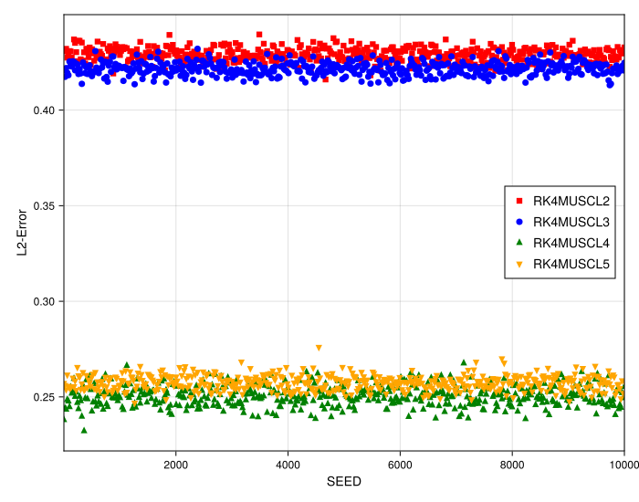
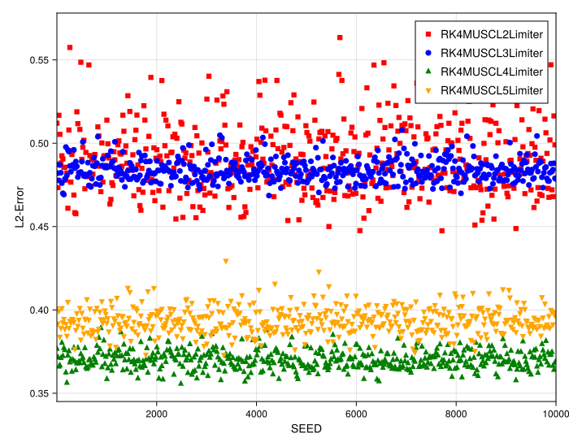
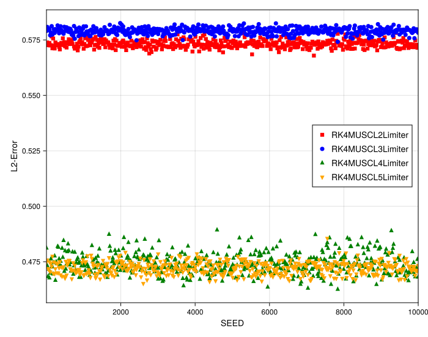
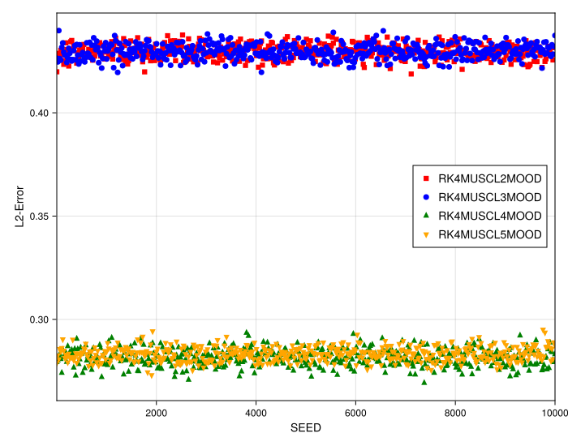

# 1D Stability Study (Discontinuous Function)

## Introduction

This document analyzes the stability and error variance of high-order 1D MUSCL schemes when applied to a discontinuous "box" initial condition on a highly irregular grid.

This study contrasts with the previous smooth (Gaussian) stability test, where higher-order interpolations (`MUSCL3`, `MUSCL5`) showed a clear reduction in error variance, making them more stable. Here, we investigate if that benefit persists in the presence of discontinuities.

## Experimental Setup

-   **PDE**: 1D Linear Advection (`linear`)
-   **Initial Condition**: Box Function (`box`)
-   **Resolution**: `N = 200`
-   **Grid Irregularity**: `randomness_factor = 0.5` (High)
-   **Timestepper**: 4th Order Runge-Kutta (`RK4`)

---

## Observation and Analysis

### 1. Standard MUSCL Schemes

-   **Grouping Persists**: The methods still show a grouping in their median error (`MUSCL2`/`3` and `MUSCL4`/`5`).
-   **Stability Benefit is Lost**: This is the key finding. Unlike the smooth case, the `RK4MUSCL3` and `RK4MUSCL5` schemes **do not** show a smaller error variance than their `RK4MUSCL2` and `RK4MUSCL4` counterparts. The box plots are all of comparable size.
-   **Analysis**: In contrast to the smooth IC, the error generation is no longer dominated by grid irregularity (which high-order interpolation can handle better) but by the **discontinuity itself**. The presence of the shock neutralizes the additional stabilization benefit of the higher-order interpolations.

### 2. Stabilized Schemes (Limiters vs. MOOD)

This comparison shows the difference in stability (variance) between the different methods used to control oscillations.

-   **Limiter Comparison**: The **`MinMod` Limiter** (`stability_box_limiter.svg`) shows a *significantly larger* error variance (wider box plots) than the **`VK` Geometric Limiter** (`stability_box_limiter_VK.svg`).
-   **MOOD Scheme**: The `MOOD` scheme (`stability_box_mood.svg`) also shows a very well-controlled, low variance, similar to the `VK` limiter.
-   **Analysis**: This is an expected trade-off. The `VK` limiter is known to be more diffusive than `MinMod`. This extra diffusion, which led to a slightly lower convergence order (`O(0.25)` vs `O(0.3)`) in the previous study, is precisely what gives it **better stability** and less sensitivity to the grid/shock (i.e., lower variance).

## Conclusion

1.  For discontinuous problems, the **stabilizing benefit of high-order interpolation is lost**. The error is dominated by the shock, making `MUSCL3` and `MUSCL5` no more stable (in terms of variance) than `MUSCL2` and `MUSCL4`.
2.  More diffusive stabilization methods, like the **`VK` limiter, lead to more stable solutions** (less variance) than less diffusive ones like `MinMod`, confirming the classic trade-off between accuracy and robustness.