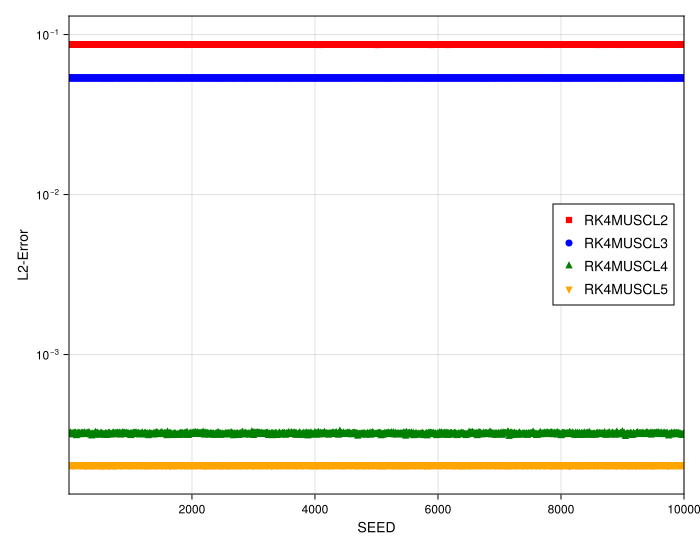
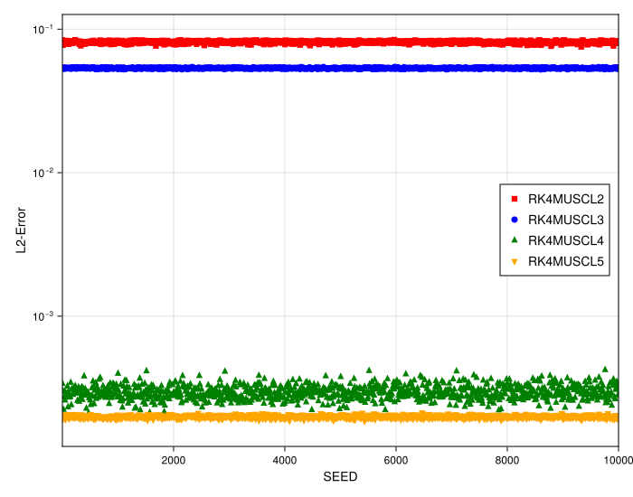
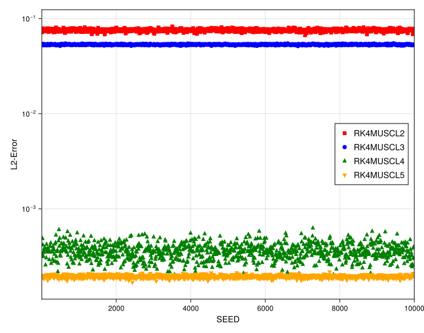
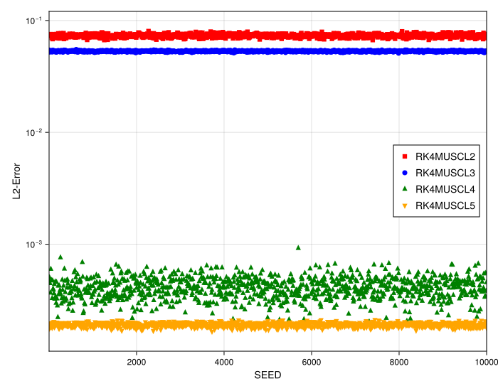

# 1D MUSCL Stability and Convergence Study (High Resolution)

## Introduction

This document analyzes a second numerical study on the stability and convergence of high-order 1D MUSCL schemes. This run uses a higher resolution (`N=200`) to re-evaluate the stability of high-order methods on highly irregular grids.

The previous study (`N=100`) showed that while 2nd and 3rd-order methods were robust, 4th and 5th-order methods became unstable at high (`0.45`) and max (`0.5`) randomness factors. This study investigates if that instability was a low-resolution phenomenon.

## Experimental Setup

The experiment solves the 1D linear advection equation, tracking the convergence of a smooth Gaussian pulse.

-   **PDE**: 1D Linear Advection (`linear`)
-   **Initial Condition**: Gaussian Pulse (`init_func = gauss`)
-   **Resolution**: Higher (`N=200`)
-   **Max Time (`tmax`)**: `10.0`
-   **Timestepper**: 4th Order Runge-Kutta (`RK4`)
-   **Methods (Orders) Tested**:
    -   `RK4MUSCL2` (2nd Order)
    -   `RK4MUSCL3` (3rd Order)
    -   `RK4MUSCL4` (4th Order)
    -   `RK4MUSCL5` (5th Order)
-   **Grid Irregularity (Variable)**: The study compares four scenarios with increasing irregularity:
    -   **Low**: `randomness_factor = 0.2`
    -   **Medium**: `randomness_factor = 0.35`
    -   **High**: `randomness_factor = 0.45`
    -   **Max**: `randomness_factor = 0.5`

---

## Observation of Plots

### 1. High-Order Methods are Now Fully Stable

This is the most significant finding from the high-resolution run. The instabilities previously observed in the 4th and 5th order methods at high and max irregularity are **completely gone**.

-   Even at the "Max" randomness (`randomness_factor = 0.5`), the `RK4MUSCL4` and `RK4MUSCL5` schemes are stable.
-   The convergence plots no longer show any outliers, rendering the "noOutliers" plots from the previous study redundant. All methods are stable for all seeds.
-   
-   
-   
-   

### 2. Irregularity Increases Error Variance

While the instabilities are gone, the primary effect of grid irregularity remains. As the `randomness_factor` increases from "Low" (0.2) to "Max" (0.5), the box-plots for all methods become visibly wider.

This confirms that while stable, the schemes' accuracy is more sensitive to the specific grid configuration on more irregular grids.

### 3. Convergence Order is Preserved

As with the previous study, the slopes of the convergence lines are clearly preserved. The `MUSCL5` line remains the steepest, followed by `MUSCL4`, `MUSCL3`, and `MUSCL2`.

## Analysis

This high-resolution study provides a crucial clarification:

1.  **Stability is Resolution-Dependent**: The instabilities seen in `RK4MUSCL4` and `RK4MUSCL5` in the previous study were **low-resolution artifacts**. By increasing the particle count to `N=200`, the schemes are fully stabilized, even on highly irregular grids (`randomness_factor = 0.5`).

2.  **High-Order Schemes are Viable**: This demonstrates that the high-order MUSCL formulations are robust and viable, provided the resolution is sufficient.

3.  **Irregularity's Main Effect is Variance**: The key takeaway is reinforced. The primary effect of grid irregularity on these stable, high-order meshfree schemes is not a loss of convergence order, but an increase in the error variance (i.e., the "scatter" of the results).
