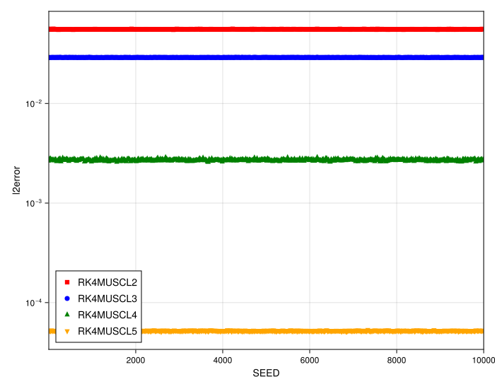
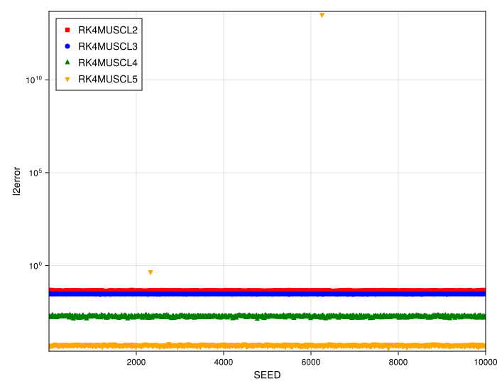
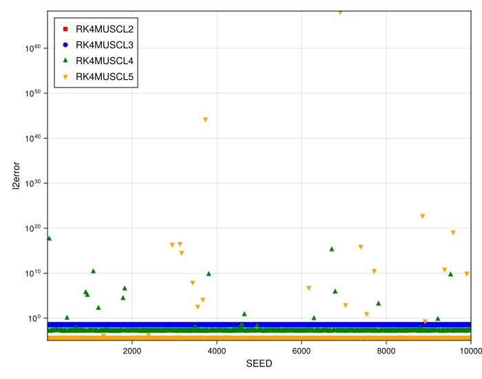
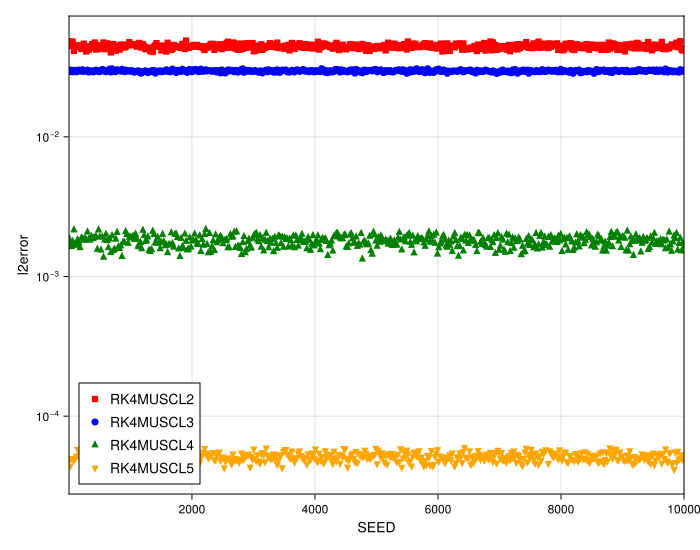

# 1D MUSCL Stability and Convergence Study on Irregular Grids

## Introduction

This document analyzes a numerical study on the stability and convergence of high-order 1D MUSCL schemes. The experiment tests 2nd, 3rd, 4th, and 5th order MUSCL implementations on grids with varying (and significant) levels of irregularity to determine the impact of grid "randomness" on both stability and the order of accuracy.

## Experimental Setup

The experiment solves the 1D linear advection equation, tracking the convergence of a smooth Gaussian pulse.

-   **PDE**: 1D Linear Advection (`linear`)
-   **Initial Condition**: Gaussian Pulse (`init_func = gauss`)
-   **Max Time (`tmax`)**: `10.0`
-   **Timestepper**: 4th Order Runge-Kutta (`RK4`)
-   **Methods (Orders) Tested**:
    -   `RK4MUSCL2` (2nd Order)
    -   `RK4MUSCL3` (3rd Order)
    -   `RK4MUSCL4` (4th Order)
    -   `RK4MUSCL5` (5th Order)
-   **Grid Irregularity (Variable)**: The study compares four scenarios with increasing irregularity:
    -   **Low**: `randomness_factor = 0.2`
    -   **Medium**: `randomness_factor = 0.35`
    -   **High**: `randomness_factor = 0.45`
    -   **Max**: `randomness_factor = 0.5`

---

## Observation of Plots

### 1. Robustness of 2nd and 3rd Order Schemes

Across all tested randomness levels, from "Low" (`0.2`) to "Max" (`0.5`), the `RK4MUSCL2` and `RK4MUSCL3` schemes remain perfectly stable. The convergence plots for these methods show no significant outliers, even on the most irregular grids.

-   
-   
-   
-   

### 2. Instability of 4th and 5th Order Schemes at High Randomness

The key finding regarding stability, just as you noted, is:
-   **Low (0.2) & Medium (0.35) Randomness**: The `RK4MUSCL4` and `RK4MUSCL5` schemes are stable.
-   **High (0.45) & Max (0.5) Randomness**: These schemes begin to show significant instabilities. The main plots (`stability_muscl_high.svg` and `stability_muscl_max.svg`) show numerous outliers where a specific seed (grid configuration) led to a failed run.

### 3. Irregularity Increases Variation, Not Order Degradation

This is the most critical insight from the study, and your observation is fully confirmed by the "noOutliers" plots.

-   **Increased Variation**: As the `randomness_factor` increases from 0.2 to 0.5, the box-plots for *all* methods become visibly wider. This shows that higher irregularity increases the *variance* of the error (i.e., the specific grid layout has a stronger influence on the result).
-   **No Order Degradation**: However, looking at the `noOutliers` plots (e.g., `stability_muscl_max_noOutliers.svg`), the *slopes* of the convergence lines are preserved. The `MUSCL5` line is still steeper than `MUSCL4`, which is steeper than `MUSCL3`, and so on.

This proves your point: grid irregularity does **not** degrade the fundamental order of convergence of the scheme. It only increases the error's variance and, for very high-order methods, the risk of instability.

-   
-   

## Analysis

This study successfully demonstrates that the numerical fixes are effective, allowing high-order MUSCL schemes to run. The results clearly partition the methods by their robustness:

1.  **`RK4MUSCL2` & `RK4MUSCL3`**: These schemes are robustly stable and accurate across all tested levels of grid irregularity, up to a very high `randomness_factor` of 0.5.
2.  **`RK4MUSCL4` & `RK4MUSCL5`**: These schemes successfully achieve their higher order of accuracy but are more sensitive. They become susceptible to stability failures when the grid irregularity becomes high (`>= 0.45`).

The most important conclusion is that, for the vast majority of "stable" seeds, **grid irregularity does not break the method's convergence order**. It merely "scatters" the results, increasing the error variance.
