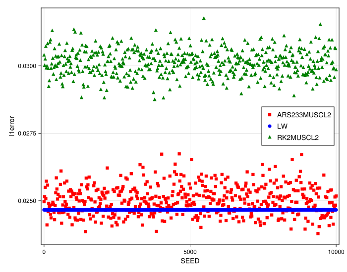
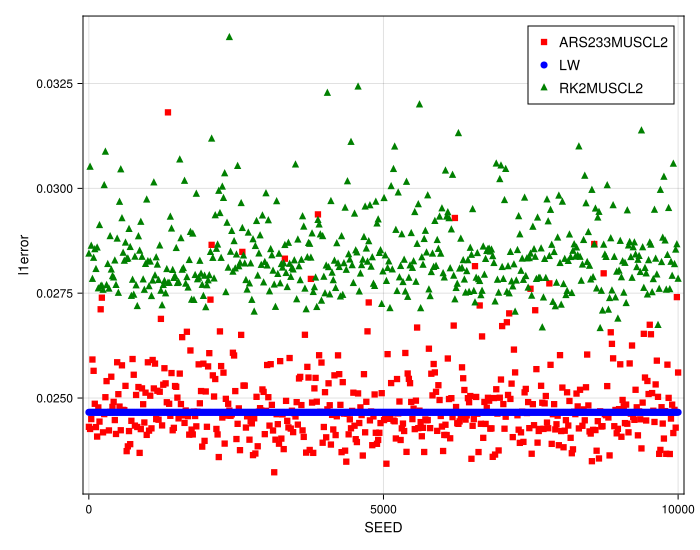
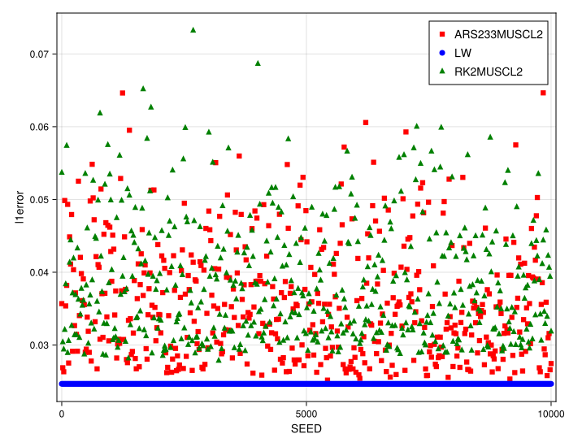
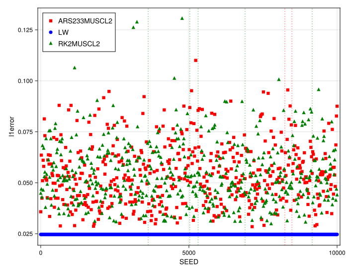

### Numerical Experiment: Stability on Randomized Grids

A key advantage of meshfree methods is their ability to operate on non-uniform or even unstructured point distributions. However, this flexibility can come at a cost to stability and accuracy. This experiment investigates the robustness of the implemented meshfree schemes by solving the linear advection equation with a sharp discontinuity on a series of randomly perturbed grids.

#### Experimental Setup

The test problem is the one-dimensional linear advection equation, $u_t + a u_x = 0$, with a shock wave (step function) as the initial condition. For each numerical method, a large number of simulations are run, each with a different particle grid generated using a unique `SEED` for the random number generator. The degree of irregularity in the grid is controlled by the `randomness_factor` parameter, which defines the maximum perturbation of a particle from its uniform grid position as a fraction of the cell size $\Delta x$. We test four levels of grid perturbation:
* **Low Randomness:** `randomness_factor = 0.2`
* **Medium Randomness:** `randomness_factor = 0.35`
* **High Randomness:** `randomness_factor = 0.45`
* **Maximum Randomness:** `randomness_factor = 0.5`, which is the theoretical limit where adjacent particles can touch, potentially creating a singular stencil.

The final L1 error (`l1error`) is plotted against the `SEED` for each run. The classical second-order Lax-Wendroff (`LW`) scheme, which is only defined for uniform grids, is included in each plot as a constant baseline for comparison.

#### Rationale for Method Selection

This study compares two second-order meshfree methods, `ARS233MUSCL2` and `RK2MUSCL2`, against the classical `LW` scheme. The goal is to observe how the error in the meshfree methods changes from one random grid to another, and to identify the point at which grid quality degradation leads to instability.

#### Observations

The results for the four levels of grid randomness are presented in the figures below.

##### Low Randomness (`randomness_factor = 0.2`)

At a low level of randomness, the meshfree methods are stable for all seeds. The `LW` scheme (blue circles) provides a constant, low-error baseline. Both `ARS233MUSCL2` (red squares) and `RK2MUSCL2` (green triangles) exhibit a scatter of errors, with most results being slightly higher than the uniform-grid baseline. This indicates a small but consistent loss of accuracy due to the grid perturbation.

##### Medium Randomness (`randomness_factor = 0.35`)

With medium randomness, the scatter in the L1 error for the meshfree methods increases. The average error is noticeably higher than the `LW` baseline, and the variance between different seeds is larger. However, the methods remain stable across the entire range of tested seeds.

##### High Randomness (`randomness_factor = 0.45`)

At a high level of randomness, the trend continues. The cloud of error points for the meshfree schemes is significantly wider and shifted upwards, indicating a further degradation in accuracy and a stronger dependence on the specific grid configuration. A few outlier points with much higher error begin to appear, signaling the onset of poor stencil conditioning for certain grids.

##### Maximum Randomness (`randomness_factor = 0.5`)

At the maximum randomness level, the behavior changes dramatically. While many grid configurations still produce a solution, a significant number of outliers appear for both meshfree methods. These points, indicated by the dashed lines in the prompt's description, represent simulations where the error is orders of magnitude higher, signifying a catastrophic loss of stability. The scheme has failed for these specific, poorly-conditioned particle arrangements.

#### Analysis and Conclusion

This experiment clearly demonstrates the trade-off between the geometric flexibility of meshfree methods and their conditional stability. The accuracy and robustness of the `MUSCL` reconstruction, which relies on a Moving Least Squares (MLS) fit, is highly dependent on the quality of the local particle stencil.

The primary conclusion is that while the meshfree methods are robust to moderate levels of grid irregularity, they can become unstable when the grid quality degrades significantly. The `randomness_factor = 0.5` case is particularly illustrative: allowing particles to become arbitrarily close creates stencils where the MLS matrix is ill-conditioned or singular. This leads to erroneous calculations of the spatial derivatives and causes the numerical scheme to blow up.

In contrast, the classical `LW` scheme is perfectly stable with a constant error, but it is fundamentally restricted to uniform grids. This highlights that for meshfree methods to be used reliably in practice, especially high-order ones, some guarantee of grid quality (e.g., a minimum particle separation distance) is necessary to prevent the formation of pathological stencils.