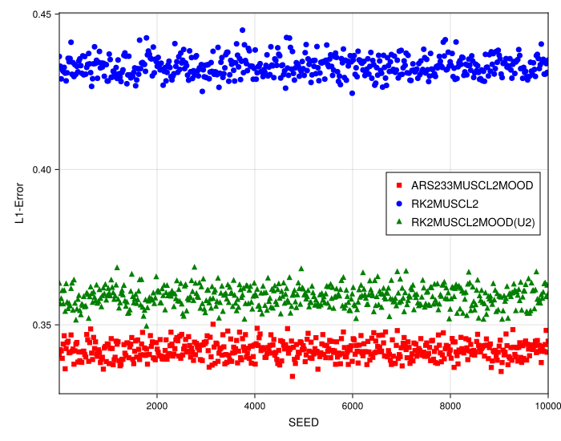
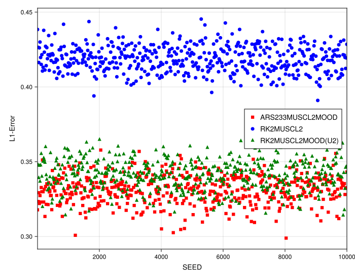
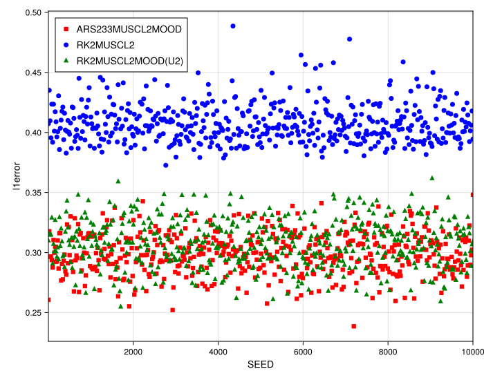
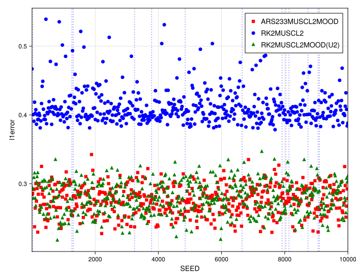

### Numerical Experiment: Stability on Randomized Grids with a Box Initial Condition

This experiment further investigates the robustness of the meshfree methods by applying them to a more challenging non-smooth problem: the linear advection of a box function. This initial condition contains two discontinuities, providing a rigorous test for the stability of the spatial reconstruction and the effectiveness of the MOOD framework.

#### Experimental Setup

The test problem is the one-dimensional linear advection equation, $u_t + a u_x = 0$. The initial condition is a box function, which is zero outside a finite interval and one inside. The simulations are performed on a series of randomly perturbed grids, with the degree of irregularity controlled by the `randomness_factor`. We test four levels of grid perturbation:
* **Low Randomness:** `randomness_factor = 0.2`
* **Medium Randomness:** `randomness_factor = 0.35`
* **High Randomness:** `randomness_factor = 0.45`
* **Maximum Randomness:** `randomness_factor = 0.5`, the limit where adjacent particles can touch.

For each randomness level, a large number of simulations are run with different `SEED`s. The final L1 error (`l1error`) is plotted against the `SEED` for each run to create a statistical profile of the scheme's performance.

#### Rationale for Method Selection

The study compares an unlimited high-order meshfree scheme (`RK2MUSCL2`) against its MOOD-stabilized counterparts (`ARS233MUSCL2MOOD` and `RK2MUSCL2MOOD(U2)`). The goal is to determine if MOOD can control the spurious oscillations expected from a high-order scheme at the box's sharp corners and to assess if this control enhances the overall stability on highly irregular grids.

#### Observations

The results for the four levels of grid randomness are presented in the figures below.

##### Low and Medium Randomness (`randomness_factor = 0.2` and `0.35`)

Across both low and medium randomness levels, a clear separation in performance is visible. The unlimited `RK2MUSCL2` scheme (blue circles) consistently produces a much higher L1 error than the MOOD-stabilized schemes (red squares and green triangles). This is due to the large, non-physical oscillations (Gibbs phenomenon) that the unlimited scheme generates at the two discontinuities. The MOOD framework successfully detects and eliminates these oscillations, resulting in a significantly more accurate solution with a lower L1 error.

##### High Randomness (`randomness_factor = 0.45`)

As the grid irregularity increases, the performance gap widens. The error of the unlimited `RK2MUSCL2` scheme becomes more scattered and trends higher, indicating its sensitivity to the grid quality. The MOOD-stabilized methods, however, maintain a tight, low-error profile, demonstrating their robustness.

##### Maximum Randomness (`randomness_factor = 0.5`)

The results at the maximum randomness level are the most revealing. The unlimited `RK2MUSCL2` scheme shows a very wide scatter of errors, with numerous outliers indicating simulations that are on the verge of instability or have failed completely due to poorly-conditioned stencils. In stark contrast, both MOOD-stabilized methods (`ARS233MUSCL2MOOD` and `RK2MUSCL2MOOD(U2)`) remain perfectly stable. Their error profiles show **no outliers**, and the results are tightly clustered in the same low-error band seen at lower randomness levels.

#### Analysis and Conclusion

This experiment demonstrates that the MOOD framework provides critical benefits for both accuracy and stability when solving problems with sharp discontinuities on irregular grids.

1.  **MOOD Enhances Accuracy:** For non-smooth solutions, the primary source of error in high-order schemes is often the spurious oscillations near jumps. By effectively removing these oscillations, the MOOD framework not only produces a more physically plausible solution but also dramatically reduces the integrated error, as measured by the L1 norm.

2.  **MOOD Guarantees Stability:** The most significant finding is the exceptional robustness of the MOOD-stabilized schemes. While the underlying unlimited method fails on the most challenging grids (at `randomness_factor = 0.5`), the MOOD framework successfully handles every single case without producing outliers. The fallback to a robust first-order method provides a safety net that prevents the simulation from failing when it encounters a pathological particle arrangement.

In conclusion, for problems involving sharp features on non-uniform grids, the MOOD framework is not just an optional add-on but an essential component. It is simultaneously a tool for enhancing accuracy (by removing oscillations) and for ensuring stability, allowing the meshfree method to be applied reliably to a much wider range of challenging grid configurations.