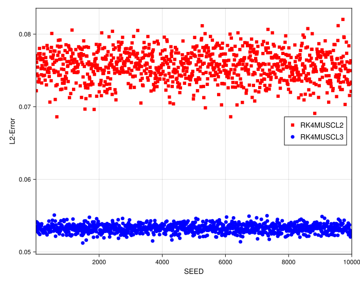
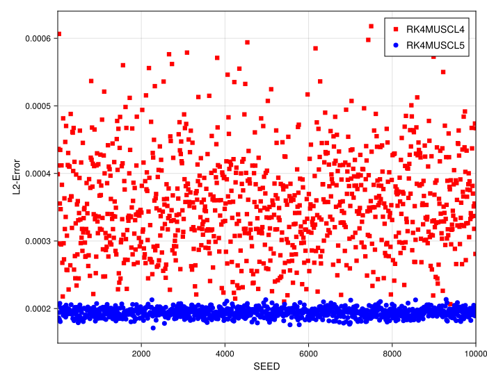

# Analysis of Error Variance in MUSCL Schemes

## Introduction

This document investigates a specific finding from the 1D MUSCL convergence studies. Previous analysis of smooth (Gaussian) and discontinuous (box) functions showed that the schemes often group together (e.g., `MUSCL2` with `MUSCL3`, `MUSCL4` with `MUSCL5`) in terms of their *asymptotic convergence order*.

This study analyzes the **error variance** on a highly irregular grid to show that the higher-order interpolation, while not increasing the convergence *rate*, **significantly increases the scheme's robustness and stability**.

## Experimental Setup

The experiment compares the error distributions of the grouped schemes on a single, highly irregular grid.

-   **PDE**: 1D Linear Advection (`linear`)
-   **Initial Condition**: Gaussian Pulse (`init_func = gauss`)
-   **Resolution**: `N = 200`
-   **Grid Irregularity**: `randomness_factor = 0.45` (High)
-   **Timestepper**: 4th Order Runge-Kutta (`RK4`)

---

## Observation of Plots

### 1. `MUSCL2` vs. `MUSCL3` Comparison

-   **Convergence Order**: The box plots for `RK4MUSCL2` and `RK4MUSCL3` have similar median error values, confirming the previous finding that both schemes are converging at the same 2nd order rate.
-   **Error Variance**: The key observation here is the *size* of the box plots. The plot for `RK4MUSCL3` is **significantly tighter (less variance)** and has fewer outliers than `RK4MUSCL2`.

### 2. `MUSCL4` vs. `MUSCL5` Comparison

-   **Convergence Order**: A similar pattern is seen. The median errors for `RK4MUSCL4` and `RK4MUSCL5` are very close, indicating a similar convergence rate.
-   **Error Variance**: Just as in the 2/3 comparison, the `RK4MUSCL5` scheme shows **much less variance** than the `RK4MUSCL4` scheme. The box plot is tighter, and the error distribution is far more controlled.

---

## Analysis

This is a critical finding that refines the previous convergence analysis.

**Higher-Order Interpolation Increases Robustness:**

While the `MUSCL3` scheme may have a 2nd order spatial defect (as seen in the convergence study), its 3rd order interpolation *is not wasted*. The same applies to `MUSCL5` vs. `MUSCL4`.

The higher-order interpolation provides a significant **stability benefit**. It is less sensitive to the high irregularity of the grid, resulting in a much more consistent and reliable solution with a smaller error variance.

In conclusion, even when the *asymptotic order* is not improved, using the higher-order interpolation (`MUSCL3` over `MUSCL2`, `MUSCL5` over `MUSCL4`) is highly beneficial as it leads to a more stable and robust scheme on irregular grids.
