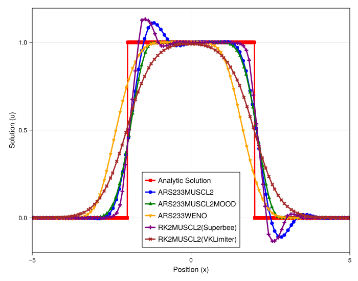

### **Numerical Experiment: Comparison of Schemes for a Discontinuity on an Irregular Grid**

This experiment evaluates the performance of various high-order schemes and stabilization techniques when applied to the linear advection of a discontinuous box profile on a non-uniform grid. The goal is to assess each method's ability to capture sharp features without oscillations while maintaining robustness on a perturbed particle distribution.

#### **Experimental Setup**

The test problem is the one-dimensional linear advection equation, u\_t+au\_x=0. The initial condition is a box function, which contains two sharp discontinuities. A key aspect of this test is the use of an **irregular grid**, generated with a randomness\_factor of 0.2. This removes the ideal structure of a uniform grid and provides a more rigorous test of the meshfree methods' stability and accuracy. The plot shows the solution at a fixed final time.

#### **Rationale for Method Selection**

The study compares a baseline unlimited high-order scheme against several stabilized alternatives to understand their behavior in this challenging scenario.

1. **Unlimited Scheme (**ARS233MUSCL2**):** This serves as the baseline to demonstrate the raw behavior of a high-order reconstruction without any stabilization.  
2. **Slope-Limited Schemes:** We test the RK2MUSCL2 scheme with two different direct limiters: the classical Superbee limiter, known for its compressive properties, and the more modern, geometry-aware VKLimiter (Venkatakrishnan), designed for robustness.  
3. **Advanced Schemes (**ARS233MUSCL2MOOD**,** ARS233WENO**):** The MOOD framework and the high-order WENO reconstruction are included as benchmarks for state-of-the-art stabilization and accuracy.

#### **Observations**

The figure presents the numerical solutions overlaid with the exact analytic solution (a perfect box function in red).

* **Unlimited Scheme (**ARS233MUSCL2**):** The blue line shows that the unlimited high-order scheme fails catastrophically. It produces severe, non-physical oscillations (Gibbs phenomenon) at both discontinuities, rendering the solution unusable. This confirms that stabilization is essential for such problems.  
* **Slope-Limited Schemes:** The two limiters show a clear trade-off between sharpness and stability.  
  * The RK2MUSCL2(Superbee) method (purple line) produces a very sharp profile that closely follows the box. However, it fails to be non-oscillatory, exhibiting a significant **overshoot** at the top corners and a slight undershoot at the bottom. While it is more accurate in the flat regions, the oscillations are physically incorrect.  
  * The RK2MUSCL2(VKLimiter) (brown line) successfully eliminates all overshoots and produces a perfectly non-oscillatory solution. However, this stability comes at the cost of **significant numerical diffusion**, resulting in a much more smeared and less accurate profile compared to other stabilized methods.  
* **Advanced Schemes (**ARS233WENO**,** ARS233MUSCL2MOOD**):** Both the WENO reconstruction (orange line) and the MOOD framework (green line) perform exceptionally well. They produce sharp, accurate, and completely non-oscillatory profiles that are nearly indistinguishable from each other and are the closest to the analytic solution.

#### **Analysis and Conclusion**

This experiment highlights the critical role of the stabilization method when applying high-order schemes to non-smooth problems on irregular grids.

The primary conclusion is that the MUSCL+MOOD **framework provides the best overall performance**, delivering a solution that is both robustly stable and highly accurate. The simple slope limiters demonstrate a fundamental compromise: the Superbee limiter is accurate but not robustly non-oscillatory, while the VKLimiter is robustly stable but overly diffusive.

The MOOD framework resolves this dilemma. By detecting problematic regions and applying a stable fallback method only where necessary, it achieves the stability of the VKLimiter while retaining the sharpness and accuracy of a high-order scheme. Its performance is on par with the more complex and computationally expensive WENO scheme, validating it as a highly effective and efficient strategy for capturing sharp features in a meshfree context.