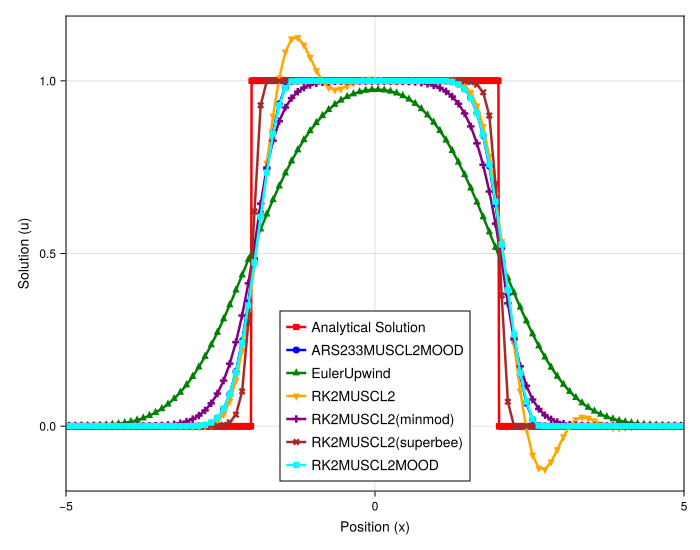
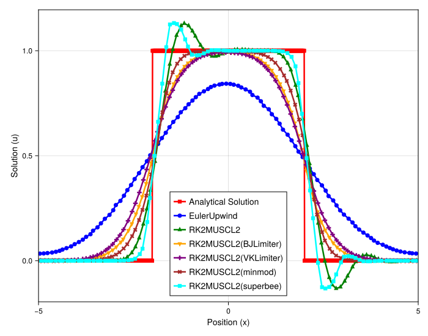
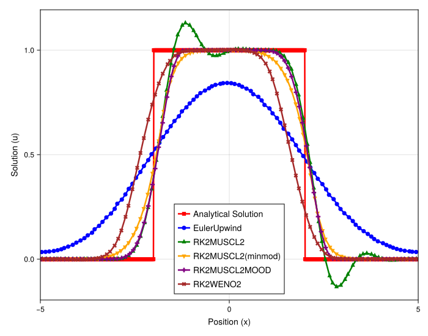

# Comparison of Limiter and MOOD Performance for Linear Advection

## Introduction

This experiment analyzes the performance of various high-resolution schemes for the linear advection of a discontinuous box profile. The primary goal is to compare the effectiveness of different slope limiters within a meshfree MUSCL framework against a MOOD-based fallback scheme. Both uniform and irregular particle distributions are tested to assess the robustness of each method to grid perturbations. The WENO scheme is also included as a high-order benchmark in the irregular case.

## Experimental Setup

The simulation solves the 1D linear advection equation, $\partial_t u + \partial_x u = 0$, on a periodic domain. The initial condition is a box function. The simulation runs for one full period, so the final solution should ideally match the initial condition.

### Shared Parameters
- **PDE**: Linear Advection (`velocity = 1.0`)
- **Domain**: `[-1, 1]` (periodic)
- **Particles (`N`)**: 100
- **Simulation Time (`tmax`)**: 2.0 (one period)
- **Timestepper**: `RalstonRK2` (2nd order Runge-Kutta)
- **Numerical Flux**: `Rusanov`

### Method-Specific Parameters

**1. Uniform Grid Comparison:**
- **Grid**: `regular = true`
- **Methods**:
    - `MUSCL-Minmod`: `main_gradient = MUSCL`, `order = 2`, `limiter = minmod`
    - `MUSCL-Superbee`: `main_gradient = MUSCL`, `order = 2`, `limiter = superbee`
    - `MUSCL-VK`: `main_gradient = MUSCL`, `order = 2`, `limiter = VK` (Venkatakrishnan)
    - `MUSCL-BJ`: `main_gradient = MUSCL`, `order = 2`, `limiter = BJ` (Barth-Jespersen)
    - `MOOD`: `main_gradient = MUSCL`, `order = 2`, `fallback_gradient = Upwind`, `MOOD = U1`

**2. Irregular Grid Comparison:**
- **Grid**: `regular = false`, `randomness_factor = 0.3`
- **Methods**:
    - `MUSCL-Minmod`: `main_gradient = MUSCL`, `order = 2`, `limiter = minmod`
    - `MUSCL-Superbee`: `main_gradient = MUSCL`, `order = 2`, `limiter = superbee`
    - `MUSCL-VK`: `main_gradient = MUSCL`, `order = 2`, `limiter = VK`
    - `MUSCL-BJ`: `main_gradient = MUSCL`, `order = 2`, `limiter = BJ`
    - `MOOD`: `main_gradient = MUSCL`, `order = 2`, `fallback_gradient = Upwind`, `MOOD = U1`
    - `WENO`: `main_gradient = WENO`, `order = 2` (Requires relaxation method)

---

## Observation of Plots

### Uniform Grid

On the uniform grid, all methods successfully advect the box profile while controlling oscillations.
- **`MUSCL-Superbee`**: Produces the sharpest and most accurate representation of the box, with very little smearing at the corners.
- **`MOOD`**: The result is nearly as sharp as Superbee, showing only slightly more rounding at the corners.
- **`MUSCL-Minmod`, `MUSCL-VK`, `MUSCL-BJ`**: These three limiters perform similarly to each other. They are significantly more diffusive than Superbee and MOOD, resulting in noticeably smeared-out shock profiles.

### Irregular Grid

On the irregular grid, the performance of the methods changes significantly.
- **`MUSCL-Superbee`**: This limiter fails catastrophically. The solution is extremely oscillatory and noisy, indicating a severe instability.
- **`MOOD`**: This method remains the top performer. It produces a clean, non-oscillatory profile with the least amount of diffusion among the successful methods.
- **`MUSCL-Minmod`, `MUSCL-VK`, `MUSCL-BJ`**: These limiters continue to perform robustly, producing stable, non-oscillatory results that are very similar to their uniform grid counterparts. They remain more diffusive than the MOOD scheme.
- **`WENO`**: The WENO scheme is stable and non-oscillatory, but it exhibits significantly more diffusion than the MOOD scheme and even more than the other MUSCL limiters.

---

## Analysis

The results highlight the critical interaction between numerical schemes and grid structure in meshfree methods.

- **Superiority of MOOD:** The MOOD scheme demonstrates superior robustness and accuracy in both uniform and irregular settings. By using a high-order `MUSCL` scheme in smooth regions and only falling back to a robust first-order `Upwind` scheme when the maximum principle is violated (i.e., at the shocks), it optimally balances accuracy and stability. This selective application of diffusion makes it the best overall method in this test.

- **Partial Failure of Ratio-Based Limiters on Irregular Grids:** The Superbee limiter is known to be highly compressive and works exceptionally well on uniform grids. However, its formulation relies on a precise ratio of upwind and downwind gradients. On an irregular grid, the geometric arrangement of neighbors is inconsistent, making the calculation of these one-sided gradients unreliable. This leads to an incorrect application of the limiter, which fails to add necessary diffusion and instead introduces the observed instabilities. The Minmod limiter is also ratio-based but is far more diffusive by nature, which likely provides enough numerical dissipation to keep it stable even when the gradient ratios are perturbed by the irregular grid.

- **Robustness of Geometric Limiters:** The Venkatakrishnan (VK) and Barth-Jespersen (BJ) limiters are geometric; they work by enforcing local bounds rather than relying on gradient ratios. This makes their formulation inherently more robust to grid perturbations, explaining why their performance is almost identical between the uniform and irregular cases.

- **WENO Performance:** While WENO is a very high-order and sophisticated scheme, its meshfree implementation here appears more diffusive than the best MUSCL-based methods. This could be due to the large stencils required for its high-order reconstructions, which may average over too many particles on an irregular grid, leading to smearing that is more pronounced than the targeted dissipation of the MOOD approach.