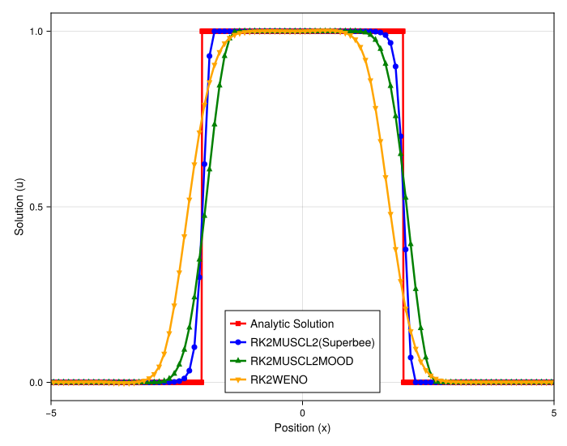
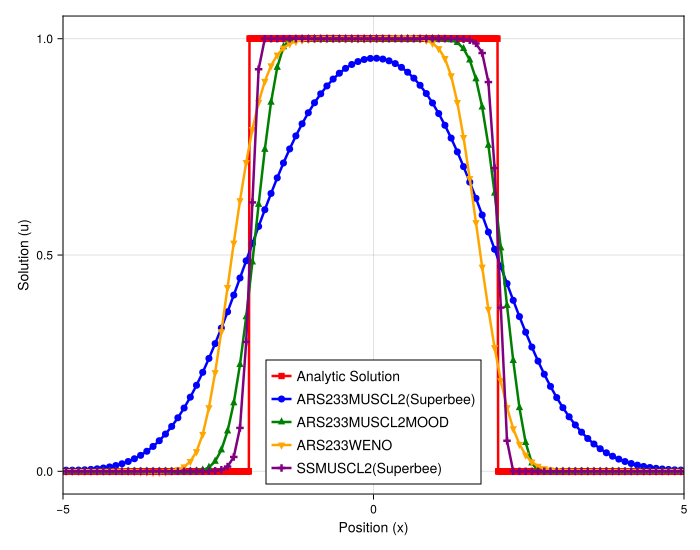

# Analysis of Direct vs. Relaxation-Based Schemes for Linear Advection

## Introduction

This experiment investigates the performance and potential interactions between spatial discretization schemes and time integration methods for a simple advection problem. The goal is to compare the results of direct time integration using an explicit Runge-Kutta scheme against those from relaxation-based methods, which are foundational for solving more complex hyperbolic systems with stiff source terms. Specifically, we examine how high-resolution methods like MUSCL with limiters, MOOD, and WENO behave when coupled with an operator-splitting scheme (`SimpleSplitting`) versus a tightly-coupled IMEX (`ARS222`) scheme.

## Experimental Setup

The simulation solves the 1D linear advection equation, $\partial_t u + \partial_x u = 0$, on a periodic domain with a box initial condition. To emulate a relaxation system, the problem is reformulated as a two-species system with velocities $v_1 = -10, v_2 = 10$ and a small relaxation parameter $\epsilon$, which recovers the target advection equation in the stiff limit. All simulations are run on a uniform grid for one period.

### Shared Parameters
- **PDE**: Linear Advection (`velocity = 1.0`)
- **Domain**: `[-1, 1]` (periodic)
- **Particles (`N`)**: 100
- **Grid**: `regular = true`
- **Simulation Time (`tmax`)**: 2.0 (one period)
- **Numerical Flux**: `Rusanov`

### Method-Specific Parameters

**1. Direct Computation:**
- **Timestepper**: `RalstonRK2` (explicit 2nd order RK)
- **Methods**:
    - `MUSCL-Superbee`: `main_gradient = MUSCL`, `order = 2`, `limiter = superbee`
    - `MOOD`: `main_gradient = MUSCL`, `order = 2`, `fallback_gradient = Upwind`, `MOOD = U1`

**2. Relaxation-Based Computation:**
- **Relaxation Velocities**: `[-10, 10]`
- **Methods**:
    - `ARS-MUSCL-Superbee`: `timestepper = ARS222` (IMEX), `main_gradient = MUSCL`, `order = 2`, `limiter = superbee`
    - `ARS-MOOD`: `timestepper = ARS222` (IMEX), `main_gradient = MUSCL`, `order = 2`, `fallback_gradient = Upwind`, `MOOD = U1`
    - `ARS-WENO`: `timestepper = ARS222` (IMEX), `main_gradient = WENO`, `order = 2`
    - `SS-MUSCL-Superbee`: `timestepper = RalstonRK2` + `SimpleSplitting` wrapper, `main_gradient = MUSCL`, `order = 2`, `limiter = superbee`

---

## Observation of Plots

### Direct Computation

The direct computation methods serve as the baseline for spatial accuracy.
- **`MUSCL-Superbee`**: Produces an extremely sharp and accurate profile, capturing the discontinuities with minimal smearing.
- **`MOOD`**: Delivers a very high-quality result that is only marginally more diffusive than `MUSCL-Superbee`. Both results are excellent.

### Relaxation Methods (IMEX and Splitting)

The relaxation-based methods show a significant divergence in performance depending on the coupling strategy.
- **`ARS-MUSCL-Superbee`**: This combination results in a dramatic loss of accuracy. The profile is heavily smeared and far more diffusive than any other method, including the baseline `MOOD` scheme.
- **`ARS-MOOD` & `ARS-WENO`**: These methods appear completely unaffected by the IMEX time-stepper. Their results are visually identical to the high-quality profiles obtained from the direct computation.
- **`SS-MUSCL-Superbee`**: The `SimpleSplitting` approach also yields a result that is visually identical to the direct `MUSCL-Superbee` computation, preserving the sharp, accurate profile.

---

## Analysis

The results clearly indicate a detrimental interaction between the MUSCL slope limiting procedure and the tightly-coupled nature of the IMEX time-stepper, an issue that does not affect MOOD or WENO schemes.

- [cite_start]**Degradation of MUSCL Limiters in IMEX Schemes:** The `ARS222` scheme is a fully-coupled IMEX method where each Runge-Kutta stage solution depends on both the explicit (advection) and implicit (relaxation) tendencies from previous stages [cite: 310-311, 261-267]. The implicit relaxation part of the solver drives the solution towards a smooth local equilibrium state. [cite_start]The `MUSCLlimited` scheme computes its slopes based on this intermediate stage solution [cite: 154-155, 162-163]. When the limiter "sees" this artificially smoothed state from the implicit solve, it incorrectly assumes the solution is less discontinuous than it actually is from an advection standpoint. This causes the limiter to be less aggressive than necessary, leading to a failure to maintain the sharp front and resulting in the observed severe numerical diffusion.

- **Success of Operator Splitting:** The `SimpleSplitting` (SS) method avoids this issue by completely decoupling the physics. [cite_start]It first performs a full, multi-stage explicit time step for the advection part only [cite: 281-282]. During this phase, the slope limiter sees the true, discontinuous advected solution and functions correctly, just as in the direct computation. [cite_start]The relaxation is then applied as a distinct post-processing step [cite: 283-287]. This confirms that the limiter itself is correct, but its interaction with the coupled IMEX stage is the source of the error.

- **Robustness of MOOD and WENO:**
    - **MOOD**: The MOOD scheme is robust because its limiting is *a posteriori*. [cite_start]It computes a full high-order candidate solution for a stage and *then* checks if the result is physically admissible (e.g., satisfies the maximum principle) [cite: 571-572]. It does not use the smoothness of the intermediate state to *calculate* a limiter coefficient; it judges the *final outcome* of the high-order step. If the outcome is bad, it discards it and substitutes a robust low-order one. This "accept/reject" logic is immune to the smoothing effects from the implicit part of the IMEX stage.
    - **WENO**: The WENO scheme's non-linear weighting mechanism is also more robust to this issue. The smoothness indicators are calculated from derivatives of the solution across several stencils. Even with the smoothing from the implicit solve, the sharp gradients from the advection part still dominate these indicators near the discontinuity, causing the non-linear weights to correctly select the stencils that do not cross the shock. This preserves the sharp profile without the degradation seen in the simpler MUSCL limiter logic.