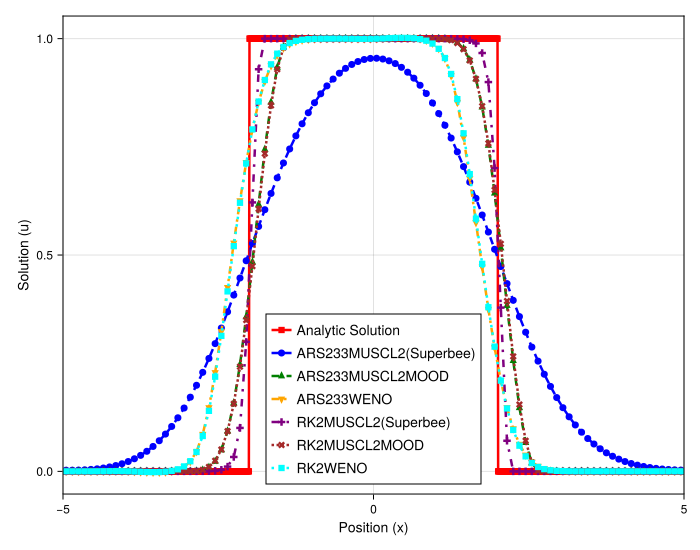

### Numerical Experiment: Comparison of Direct vs. Relaxation Schemes with Slope Limiters

This experiment investigates the performance of different stabilization techniques for a high-order meshfree method when applied to the linear advection of a discontinuous box profile. A key focus is to compare the behavior of a classical slope limiter when applied within a relaxation framework versus its application in a direct, explicit time-stepping scheme.

#### Experimental Setup

The test problem is the one-dimensional linear advection equation, $u_t + a u_x = 0$. The initial condition is a box function, which contains two sharp discontinuities. The simulation is performed on a **uniform grid** (`randomness_factor = 0.0`). This idealized setup removes errors from grid irregularity and wide stencils, allowing for a clean comparison of the fundamental properties of the schemes themselves. The plot shows the solution at a final time after the box has advected across the domain.

#### Rationale for Method Selection

The goal is to isolate the effect of the relaxation framework on a limited high-order scheme. We compare:
1.  **Directly Limited Scheme (`RK2MUSCL2(Superbee)`):** This method applies the Superbee slope limiter directly to the macroscopic variable `u` within a standard second-order Runge-Kutta timestepper. It represents the baseline performance of a direct, limited high-order method.
2.  **Relaxation-Based Limiter (`ARS233MUSCL2(Superbee)`):** This is the key method under investigation. It uses an IMEX scheme where the explicit part involves advecting two kinetic variables, $v_1$ and $v_2$. The `MUSCL2` reconstruction with the Superbee limiter is applied independently to each of these kinetic variables.
3.  **MOOD and WENO Schemes:** These are included as high-performance benchmarks. They show how more sophisticated stabilization (MOOD) or reconstruction (WENO) techniques behave in both direct and relaxation frameworks.

#### Observations

The figure clearly shows a dramatic difference in performance, particularly for the limiter-based schemes.

* **Directly Limited Scheme (`RK2MUSCL2(Superbee)`):** The purple line with cross markers shows that the direct application of the Superbee limiter is highly effective. It produces a very sharp, non-oscillatory profile that closely tracks the analytic solution, with only minor clipping at the corners, which is characteristic of this limiter.
* **Relaxation-Based Limiter (`ARS233MUSCL2(Superbee)`):** The most striking result is that the relaxation-based limiter scheme (blue dashed line with circles) is extremely diffusive. Despite being based on a second-order `MUSCL2` reconstruction, it suffers from severe numerical diffusion, smearing the sharp corners of the box into wide, sloped profiles. Its performance is far worse than all other high-order methods shown.
* **MOOD and WENO Schemes:** The MOOD and WENO-based schemes (green, orange, brown, cyan) all perform exceptionally well, producing sharp, accurate profiles regardless of whether they are in a direct (`RK2`) or relaxation (`ARS233`) framework.

#### Analysis and Conclusion

This experiment reveals a known, critical interaction when applying classical slope limiters within a relaxation (or kinetic) framework. The excessive diffusion of the `ARS233MUSCL2(Superbee)` scheme is not a bug, but a consequence of the underlying physics of the scheme, often referred to as **"double diffusion"**.

The relaxation method decomposes the macroscopic state `u` into two kinetic variables, $v_1$ and $v_2$, which are then advected independently. For a box initial condition in `u`, the corresponding kinetic variables also have a box-like shape. The slope limiter is then applied to the reconstruction of *both* $v_1$ and $v_2$. At the sharp corners of these kinetic profiles, the limiter will aggressively reduce the reconstructed slopes to prevent oscillations, effectively making the advection of each kinetic variable a first-order, diffusive process at the discontinuities.

When the final macroscopic solution is recovered by summing the kinetic parts ($u = v_1 + v_2$), the diffusion from **both** advection steps is combined. This "double diffusion" results in a macroscopic profile that is significantly more smeared than if a limiter were applied only once to the macroscopic variable directly.

In contrast, the MOOD schemes operate differently. They compute a candidate solution for the *macroscopic* variable `u` first and then check if that final result is physically admissible. This allows the kinetic advection steps to proceed with high-order accuracy, and the stabilization is only applied to the final, combined result. This is a much more effective approach and explains why the MOOD schemes do not suffer from this excess diffusion.

The conclusion is that while relaxation schemes are powerful, naively applying standard slope limiters to the individual kinetic components can lead to excessive numerical diffusion for problems with sharp features. This demonstrates the superiority of more sophisticated stabilization techniques like MOOD, which operate on the final macroscopic quantities and can better preserve the accuracy of the underlying high-order method.