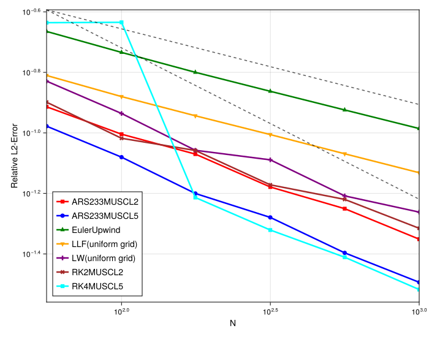
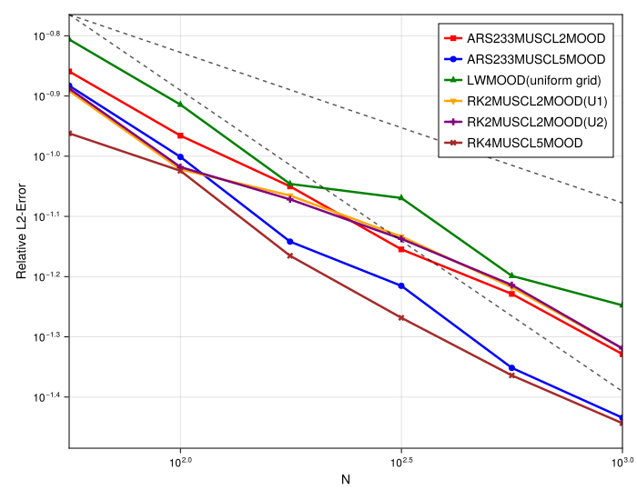

# Convergence Study for Linear Advection of a Discontinuous Profile

## Introduction

This experiment analyzes the convergence properties of the implemented high-resolution schemes when applied to a problem with a discontinuous profile (a shock). For problems with shocks, the formal high order of accuracy seen with smooth solutions is lost. Instead, the focus is on ensuring that the L2-error still decreases at a consistent, albeit lower, rate as the grid is refined. This study compares unlimited MUSCL, MOOD-based schemes, and MUSCL with different limiters to evaluate their convergence rates and robustness, particularly when coupled with different time integration strategies.

## Experimental Setup

The simulation solves the 1D linear advection equation, $\partial_t u + \partial_x u = 0$, on a periodic domain with a box function as the initial condition. The L2-error is computed at the final time `tmax` against the exact solution. The tests are run on an irregular grid.

### Shared Parameters
- **PDE**: Linear Advection (`velocity = 1.0`)
- [cite_start]**Domain**: `[-5, 5]` (periodic) [cite: 177, 180, 183]
- [cite_start]**Initial Condition**: Box (`box`) [cite: 177, 180, 183]
- [cite_start]**Grid**: Irregular (`randomness_factor = 0.2`)
- [cite_start]**Final Time (`tmax`)**: 10.0
- [cite_start]**Particle Numbers (`N`)**: `[56, 100, 177, 316, 562, 1000]` [cite: 177, 180, 183]
- [cite_start]**Spatial Scheme Base**: 2nd order `MUSCL` (linear reconstruction) [cite: 177, 180, 183]

### Method-Specific Parameters
The methods are grouped into three categories, with each category testing a direct explicit `RalstonRK2` timestepper against a coupled `ARS222` (IMEX) timestepper and, where applicable, a `SimpleSplitting` (SS) scheme.

- [cite_start]**Unlimited Schemes**: `MUSCL-O2` (direct), `ARS-MUSCL2` (IMEX), `SS-MUSCL2` (split)[cite: 180].
- [cite_start]**MOOD-based Schemes**: `MOOD` (direct), `ARS-MOOD` (IMEX), `SS-MOOD` (split)[cite: 177].
- [cite_start]**Limiter-based Schemes**: `MUSCL-BJ` (direct), `ARS-MUSCL-BJ` (IMEX), `MUSCL-VK` (direct), `ARS-MUSCL-VK` (IMEX)[cite: 183].

---

## Observation of Plots

The convergence plots show the L2-error as a function of `1/N`. Reference lines with slopes of -0.25 and -0.5 are included, corresponding to convergence rates of $O(h^{1/4})$ and $O(h^{1/2})$.

### Unlimited and MOOD-based Schemes

- [cite_start]**MOOD Schemes**: All three MOOD variants (`direct`, `ARS`, and `SS`) perform identically[cite: 178]. [cite_start]Their error curves lie perfectly on top of one another and exhibit a clean convergence rate of approximately -0.5[cite: 178].
- [cite_start]**Unlimited Schemes**: The direct `MUSCL-O2` and `SS-MUSCL2` schemes also perform identically, converging at a rate of ~-0.5[cite: 179]. [cite_start]In stark contrast, the `ARS-MUSCL2` scheme shows a much higher error and a significantly degraded, nearly flat convergence rate[cite: 179].

### Limiter-based Schemes

- [cite_start]**Barth-Jespersen (BJ) Limiter**: The direct `MUSCL-BJ` scheme converges at the expected rate of ~-0.5[cite: 182]. [cite_start]The `ARS-MUSCL-BJ` version suffers from the same degraded convergence as the unlimited ARS scheme[cite: 182].
- [cite_start]**Venkatakrishnan (VK) Limiter**: The direct `MUSCL-VK` scheme shows a lower convergence rate of approximately -0.25[cite: 182]. [cite_start]The `ARS-MUSCL-VK` version shows essentially no convergence at all[cite: 182].

---

## Analysis

The results confirm the expected convergence rates for robust high-resolution schemes on discontinuous problems and reveal a critical weakness in MUSCL schemes that rely on *a priori* slope information when coupled with IMEX time integrators.

- **Expected Shock Convergence Rate**: For high-resolution, non-oscillatory schemes, the L2-error for problems with discontinuities is theoretically expected to converge at a rate of $O(h^{1/2})$. [cite_start]The observed ~-0.5 slope for the MOOD schemes and the direct/split versions of `MUSCL-BJ` confirm this expected behavior[cite: 178, 182].

- [cite_start]**Failure of IMEX with a priori Limiters**: A clear pattern emerges: any scheme using the `ARS222` IMEX timestepper combined with a `MUSCL` reconstruction that depends on *a priori* slope calculations (`MUSCLlimited` and the unlimited `MUSCL`) fails to converge correctly[cite: 179, 182]. This is because the tight coupling in the IMEX scheme causes the implicit relaxation step to smooth the intermediate stage solutions. This "polluted," overly smooth state is then used by the MUSCL scheme to calculate its reconstruction slopes. This incorrect information about the solution's structure breaks the consistency of the spatial discretization and destroys its convergence.

- **Robustness of a posteriori MOOD**: The MOOD scheme is immune to this issue because its limiting mechanism is *a posteriori*. [cite_start]It computes a full high-order candidate solution and *then* checks if the result is physically admissible[cite: 558, 563]. It does not depend on the smoothness of the intermediate stage to calculate its parameters. If the high-order step produces an invalid result, it is simply discarded and replaced with a robust low-order one. This "accept/reject" logic is not affected by the IMEX-induced smoothing.

- [cite_start]**Sub-optimal Convergence of Venkatakrishnan Limiter**: The VK limiter, even with a direct explicit time-stepper, shows a degraded convergence rate of $O(h^{1/4})$[cite: 182]. This limiter is known to be overly diffusive near sharp corners and can apply excessive limiting at shocks. This prevents the shock from sharpening at the expected $O(h^{1/2})$ rate as the grid is refined, which degrades the L2-error convergence.