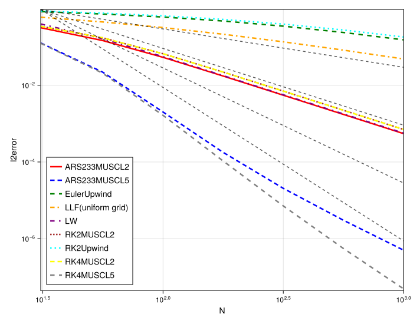
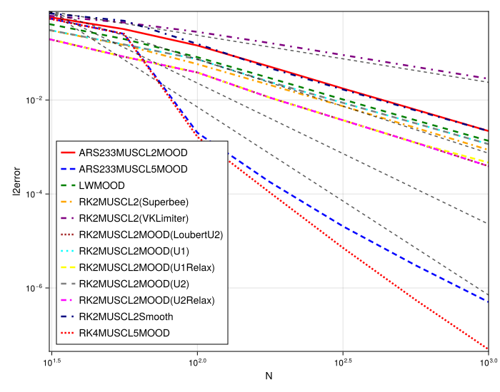

### Numerical Experiment: Convergence Analysis for a Smooth Profile

A fundamental validation for any numerical scheme is to verify that it achieves its theoretical order of convergence for a problem with a smooth solution. This experiment is designed to measure the convergence rates of the various implemented methods by solving the linear advection equation on a uniform grid with a smooth initial condition.

#### Experimental Setup

The test problem is the one-dimensional linear advection equation, $u_t + a u_x = 0$, with an advection speed of $a=1.0$. The initial condition is a smooth Gaussian pulse, $u(x, 0) = \exp(-x^2)$, centered at the origin. The simulation is performed on a periodic domain, `xmin` = -5.0 to `xmax` = 5.0. The final time is set to `tmax` = 10.0, which corresponds to exactly one full period of the wave traversing the domain and returning to its initial position. This setup allows for a direct measurement of the accumulated numerical error over a long integration time.

The convergence study is performed by running a series of simulations for each numerical method, systematically increasing the number of particles `N` (from approximately $10^{1.5} \approx 32$ to $10^3 = 1000$). The time step $\Delta t$ is coupled to the spatial resolution via a fixed Courant-Friedrichs-Lewy number of `CFL` = 0.2 to ensure that the temporal error from the Runge-Kutta schemes does not dominate the spatial error. For each simulation, the L2 error of the numerical solution is computed at the final time. The results are presented in a log-log plot of the L2 error versus the number of particles `N`, where the slope of the line corresponds to the observed order of convergence.

#### Rationale for Method Selection

The purpose of this study is to confirm that the implemented spatial discretizations and their coupling with appropriate time integrators yield the expected order of accuracy. We compare:
1.  **First-Order Schemes:** `EulerUpwind` and the classical Lax-Friedrichs (`LLF`) method are expected to show first-order convergence.
2.  **Second-Order Schemes:** The classical Lax-Wendroff (`LW`) and meshfree methods combining a second-order Runge-Kutta timestepper with a second-order MUSCL reconstruction (`RK2MUSCL2`) are expected to be second-order accurate.
3.  **High-Order Schemes:** Combinations of high-order timesteppers (`RK4`, `ARS233`) and high-order MUSCL reconstructions (`MUSCL5`, which corresponds to a 4th-order reconstruction) are tested to verify if they achieve the higher design accuracy.

#### Observations

The figure presents the L2 error as a function of the number of particles `N` on a log-log scale. Dashed grey lines are included for reference, indicating slopes corresponding to first, second, third, and fourth-order convergence.

* **First-Order Methods:** The `EulerUpwind` (green dash-dot) and `LLF` (orange dash-dot) methods produce lines that are parallel to the reference line with a slope of -1. This confirms their expected first-order accuracy.
* **Second-Order Methods:** The `LW` (purple dotted), `RK2MUSCL2` (cyan dotted), `ARS233MUSCL2` (red solid), and `RK4MUSCL2` (yellow dashed) methods all produce lines that are parallel to the reference line with a slope of -2. This is the expected second-order convergence. Notably, pairing a fourth-order timestepper (`RK4`) with a second-order spatial scheme (`MUSCL2`) still results in a second-order accurate method, as the overall accuracy is limited by the lowest-order component, which in this case is the spatial discretization.
* **High-Order Methods:** The `ARS233MUSCL5` (blue dashed) and `RK4MUSCL5` (grey dashed) methods show a significantly steeper slope. Their convergence lines are parallel to the reference line with a slope of -4, demonstrating clear fourth-order convergence.

#### Analysis and Conclusion

The results of this convergence study successfully validate the implementation of the numerical schemes. Each method achieves its theoretically expected order of accuracy for a smooth problem on a uniform grid.

The key conclusion is that the **meshfree `MUSCL` implementation correctly provides higher-order spatial accuracy when requested**. Increasing the reconstruction order from linear (`MUSCL2`) to quartic (`MUSCL5`) and pairing it with a sufficiently high-order timestepper (`RK4` or `ARS233`) successfully increases the overall order of the scheme from second to fourth. This demonstrates that the framework is capable of high-order accuracy and that the MLS-based reconstruction of higher-order derivatives is working as intended under these ideal conditions.

### Numerical Experiment: Convergence of Stabilized Schemes for a Smooth Profile

This experiment investigates a critical aspect of high-order numerical methods: whether the stabilization mechanisms required for discontinuous solutions, such as slope limiters and the Multi-dimensional Optimal Order Detection (MOOD) framework, degrade the accuracy and convergence rate when applied to problems with smooth solutions. An ideal stabilization scheme should remain inactive for smooth flows, thereby preserving the high order of accuracy of the base scheme.

#### Experimental Setup

The test problem is the one-dimensional linear advection equation, $u_t + a u_x = 0$, with an advection speed of $a=1.0$. The initial condition, given by `init_func: gauss`, is a smooth Gaussian pulse defined as:
$$
u(x, 0) = 1.0 \cdot \exp\left(-\left(\frac{x - 0.0}{1.0}\right)^2\right)
$$
The simulation is performed on a periodic domain from `xmin` = -5.0 to `xmax` = 5.0. The final time is set to `tmax` = 10.0, corresponding to one full period of the wave traversing the domain.

The convergence study is performed on a series of uniform grids (`randomness_factor = 0.0`) by systematically increasing the number of particles `N` from approximately $10^{1.5} \approx 32$ to $10^3 = 1000$. The time step $\Delta t$ is coupled to the spatial resolution via a fixed Courant-Friedrichs-Lewy number of `CFL` = 0.2. The L2 error is computed at the final time and plotted against `N` on a log-log scale to observe the convergence rates.

#### Rationale for Method Selection

This study focuses exclusively on stabilized methods to quantify the impact of different stabilization strategies on a smooth solution where they should, ideally, do no harm. We compare:
1.  **Slope-Limited Schemes:** We test a second-order MUSCL reconstruction (`MUSCL2`) paired with a second-order Runge-Kutta timestepper (`RK2MUSCL2`) and two different limiters: the classical `Superbee` limiter and the more modern, geometry-aware `VKLimiter` (Venkatakrishnan).
2.  **MOOD-Stabilized Schemes:** We test various `RK2MUSCL2MOOD` and `ARS233MUSCL2MOOD` configurations. The key question is whether the MOOD detection criteria (e.g., `U1`, `U2`, `LoubertU2`) are "smart" enough to recognize the smooth Gaussian as a valid, non-oscillatory solution, or if they are too sensitive and incorrectly trigger the diffusive fallback scheme.
3.  **High-Order MOOD Baseline:** The `ARS233MUSCL5MOOD` and `RK4MUSCL5MOOD` methods are included to show the behavior of MOOD when paired with a very high-order spatial reconstruction.

#### Observations

The figure presents the L2 error as a function of `N` on a log-log scale. Dashed grey lines indicate reference slopes for first, second, third, and fourth-order convergence.

* **High-Order MOOD Schemes:** The `ARS233MUSCL5MOOD` (dark blue dashed line) and `RK4MUSCL5MOOD` (dotted red line) are the best-performing methods. Their convergence lines are steep, closely following the -4th order reference line or even steeper (as expected for a 5th order spatial method). This demonstrates that the MOOD framework is not interfering with the high-order accuracy for this smooth problem.
* **Slope-Limited Schemes:** This comparison reveals a critical difference in how the implemented limiters handle smooth extrema.
    * The `RK2MUSCL2(VKLimiter)` method (purple dotted line) shows a clear degradation of accuracy. Its convergence rate is only **first-order**, indicating that this implementation of the Venkatakrishnan limiter is overly aggressive for this test case, clipping the smooth peak of the Gaussian and destroying the second-order accuracy of the underlying scheme.
    * In contrast, the `RK2MUSCL2(Superbee)` (orange dash-dot line) successfully maintains a **second-order convergence rate**. Its error is higher than the MOOD-based schemes but follows the correct slope, suggesting it is less restrictive on this smooth profile.
* **Second-Order MOOD Schemes:** All variants, including `ARS233MUSCL2MOOD` (solid red) and the various `RK2MUSCL2MOOD` methods (cyan, yellow, grey, magenta lines), successfully preserve the **second-order convergence** of the underlying `MUSCL2` spatial discretization. They exhibit slightly different error constants (vertical shift) but share the same convergence slope.

#### Analysis and Conclusion

This experiment provides crucial insights into the behavior of the implemented stabilization techniques on smooth solutions.

1.  **Limiter Performance on Smooth Extrema:** The results show a significant performance difference between the tested limiters. The `VKLimiter` proves to be too diffusive for this problem, reducing the scheme's accuracy to first-order. The `Superbee` limiter, while often considered more compressive for shocks, is less damaging to the accuracy on this smooth profile, preserving the second-order convergence rate. This highlights the sensitivity of limiter performance to the specific implementation and problem type.
2.  **MOOD is Robust and Order-Preserving:** The MOOD framework proves to be an excellent choice for a general-purpose scheme. It correctly avoids catastrophic failure and maintains the formal order of accuracy of the base scheme (e.g., 2nd order for `MUSCL2`, and high order for `MUSCL5`). While it may introduce a small amount of numerical diffusion compared to a fully unlimited scheme (resulting in a slightly higher error constant), it does not break the convergence rate on smooth problems, making it a reliable stabilization strategy.

In conclusion, for a general-purpose scheme that must handle both smooth and discontinuous problems, a well-tuned MOOD framework is a highly effective strategy. If using a standalone limiter, its behavior on smooth profiles must be carefully verified, as this experiment shows that even modern limiters can degrade accuracy if not implemented or tuned correctly for the problem at hand.
