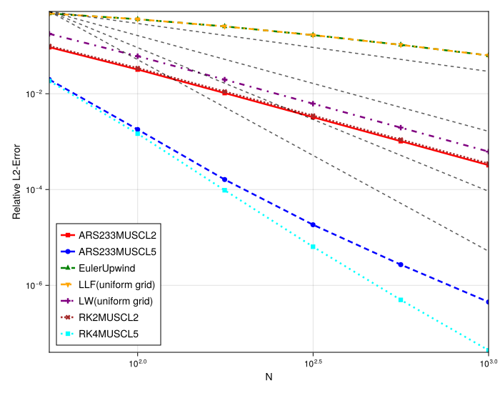
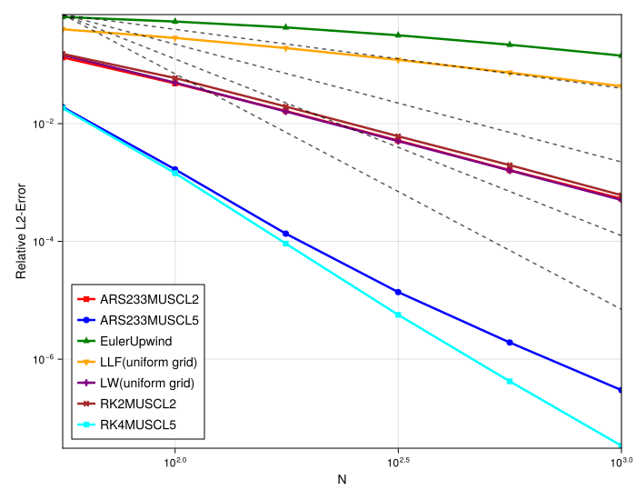

# Convergence Study for Linear Advection of a Smooth Profile

## Introduction

This experiment is a convergence study designed to numerically verify the order of accuracy of the implemented meshfree schemes. The test case involves the linear advection of a smooth Gaussian profile, for which the analytical solution is known. By running the simulation with an increasing number of particles (`N`) and measuring the L2-error against the exact solution, we can determine the experimental order of convergence from a log-log plot. The study is performed on both uniform and irregular grids to confirm the robustness and accuracy of the methods.

## Experimental Setup

The simulation solves the 1D linear advection equation, $\partial_t u + \partial_x u = 0$, on a periodic domain. The initial condition is a Gaussian function. The L2-error is computed at the final time `tmax`.

### Shared Parameters
- **PDE**: Linear Advection (`velocity = 1.0`)
- **Domain**: `[-1, 1]` (periodic)
- **Initial Condition**: Gaussian (`gaussian`)
- **Final Time (`tmax`)**: 0.2
- **Particle Numbers (`N`)**: `[56, 100, 177, 316, 562, 1000]`
- **Timestepper (Direct)**: `RK4` (4th order Runge-Kutta)

### Method-Specific Parameters

**1. Uniform Grid:**
- **Grid**: `regular = true`
- **Methods**:
    - `Upwind-O1`: 1st order `UpwindGradient`.
    - `MUSCL-O2`: 2nd order `MUSCL` (linear reconstruction).
    - `MUSCL-O3`: 3rd order `MUSCL` (quadratic reconstruction).
    - `MUSCL-O4`: 4th order `MUSCL` (cubic reconstruction).
    - `MUSCL-O5`: 5th order `MUSCL` (quartic reconstruction).

**2. Irregular Grid:**
- **Grid**: `regular = false`, `randomness_factor = 0.3`
- **Methods**:
    - `Upwind-O1`: 1st order `UpwindGradient`.
    - `MUSCL-O2`: 2nd order `MUSCL` with `interp_range_factor = 1.5`.
    - `MUSCL-O2-big`: 2nd order `MUSCL` with a larger interpolation stencil (`interp_range_factor = 3.0`).
    - `ARS-MUSCL5`: 5th order `MUSCL` (quartic) with a 3rd order IMEX time-stepper (`ARS233`).
- **Note**: The higher-order `MUSCL-O3` and `MUSCL-O4` schemes were omitted from the irregular grid tests as they exhibited stability issues in some configurations.

---

## Observation of Plots

### Uniform Grid

The convergence plot for the uniform grid shows clean, straight lines for all methods on the log-log scale.
- The observed slopes, representing the order of accuracy, align perfectly with the theoretical orders. `Upwind-O1` shows a slope of approximately -1. The `MUSCL-O2`, `MUSCL-O3`, `MUSCL-O4`, and `MUSCL-O5` schemes exhibit slopes of approximately -2, -3, -4, and -4, respectively.

### Irregular Grid

The results on the irregular grid demonstrate the robustness of the lower-order schemes and highlight challenges for higher-order methods.
- **Order Maintenance**: The `Upwind-O1` and `MUSCL-O2` schemes successfully maintain their theoretical first and second orders of convergence, respectively, demonstrating that the MLS-based spatial discretization is robust to grid perturbations for these orders.
- **Larger Stencil**: The `MUSCL-O2-big` method also shows clear second-order convergence. However, its error curve is shifted slightly upwards compared to the standard `MUSCL-O2`, indicating a slightly higher absolute L2-error for a given `N`.
- **`ARS-MUSCL5`**: This scheme initially displays a convergence rate consistent with its 4th-order spatial discretization. However, as the grid is refined (for `N` > 100), the slope of the error curve flattens to approximately -3.

---

## Analysis

The experimental results confirm that the implemented schemes achieve their expected orders of accuracy for smooth solutions on uniform grids, while also revealing the impact of grid irregularity and time-stepper order.

- **Order of Accuracy**: The convergence rates on the uniform grid directly correspond to the order of the polynomial used in the MLS reconstruction step of the `MUSCL` interpolator. [cite_start]For example, `MUSCL-O3` uses a quadratic polynomial, which yields the observed 3rd order convergence [cite: 106, 115, 132-133, 136]. The successful replication of first and second orders on the irregular grid validates the meshfree formulation's robustness at these levels. The noted stability issues for higher-order MUSCL schemes suggest that on irregular grids, the condition number of the local MLS problem may degrade, making the high-order reconstructions less reliable.

- **Effect of Stencil Size**: The `MUSCL-O2-big` variant uses a larger support domain (`interp_range_factor = 3.0`), including more particles in the MLS reconstruction for each point. While this can stabilize the polynomial fit, it also has a larger averaging effect, which acts as numerical diffusion. This increased diffusion explains the slightly higher absolute error, even though the asymptotic rate of convergence remains the same.

- **Time vs. Spatial Error Dominance in `ARS-MUSCL5`**: The behavior of the `ARS-MUSCL5` scheme is a classic example of the total error being limited by the lowest-order component of the numerical method. [cite_start]The scheme pairs a 4th-order spatial discretization (`MUSCL` with a quartic polynomial reconstruction) with a 3rd-order time integrator (`ARS233`)[cite: 488]. The total error of a simulation can be modeled as $E_{total} \approx C_{space}(\Delta x)^p + C_{time}(\Delta t)^q$. Here, $p=4$ and $q=3$. Since the time step `dt` is coupled to the grid spacing `dx` via a fixed CFL number, this becomes $E_{total} \approx C_{space}(\Delta x)^4 + C'_{time}(\Delta x)^3$.
  - At high resolutions (small $\Delta x$), the $(\Delta x)^3$ term from the time integration decreases more slowly than the $(\Delta x)^4$ term from the spatial discretization. Consequently, the time error becomes the dominant source of inaccuracy. This is precisely why the convergence curve, which initially follows the steep 4th-order spatial rate, eventually saturates at the lower 3rd-order temporal rate of the `ARS233` scheme.