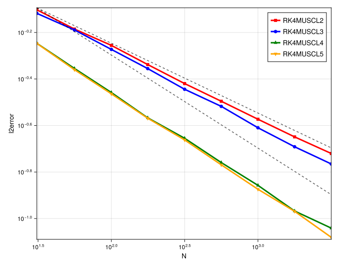
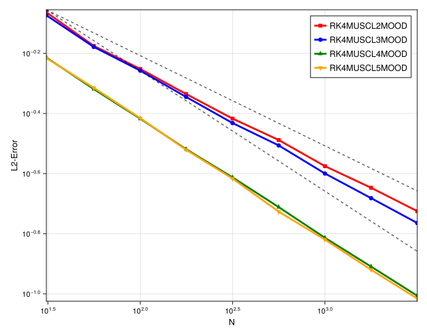
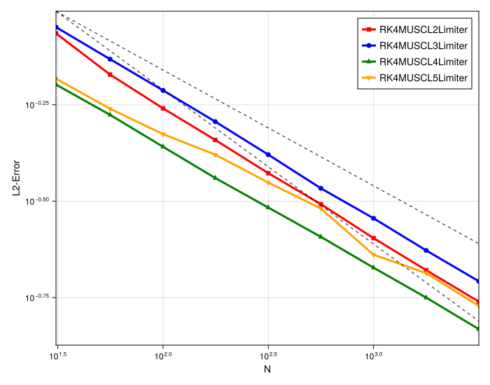
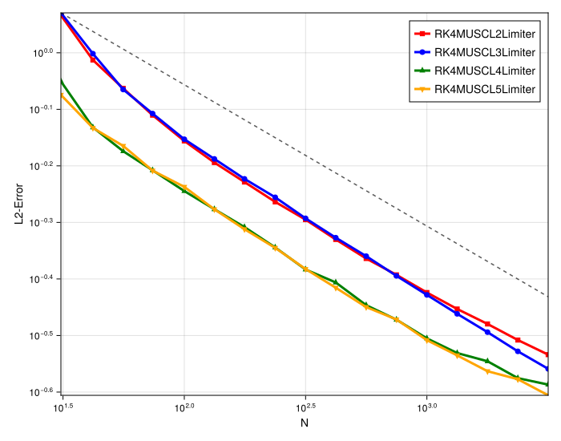

# 1D MUSCL Convergence Order Study (Discontinuous Function)

## Introduction

This document analyzes the spatial convergence order of high-order 1D MUSCL schemes when applied to a discontinuous problem (a "box" initial condition). This study is a critical counterpart to the previous one on smooth (Gaussian) functions, as the presence of discontinuities is known to challenge high-order methods.

The analysis is split into four parts to compare the performance of:
1.  **Standard MUSCL** schemes.
2.  **MUSCL + MOOD** (Multi-dimensional Optimal Order Detection).
3.  **MUSCL + Slope Limiters** (e.g., MinMod).
4.  **MUSCL + Geometric Limiters** (VK).

## Experimental Setup

-   **PDE**: 1D Linear Advection (`linear`)
-   **Initial Condition**: Box Function (`init_func = box`)
-   **Timestepper**: 4th Order Runge-Kutta (`RK4`)
-   **Timestepping**: Fixed, Small `dt` (to isolate spatial error)
-   **Methods (Plot 1)**: `RK4MUSCL2`, `RK4MUSCL3`, `RK4MUSCL4`, `RK4MUSCL5`
-   **Methods (Plot 2)**: `RK4MUSCL2MOOD`, `RK4MUSCL3MOOD`, `RK4MUSCL4MOOD`, `RK4MUSCL5MOOD`
-   **Methods (Plot 3)**: `RK4MUSCL2Limiter`, `RK4MUSCL3Limiter`, `RK4MUSCL4Limiter`, `RK4MUSCL5Limiter`
-   **Methods (Plot 4)**: `RK4MUSCL2LimiterVK`, `RK4MUSCL3LimiterVK`, `RK4MUSCL4LimiterVK`, `RK4MUSCL5LimiterVK`
-   **Reference Lines**: Various orders (`O(0.2)`, `O(0.25)`, `O(0.3)`, `O(0.4)`) are plotted for comparison.

---

## Observation of Plots

### 1. Standard MUSCL (non-MOOD)

-   **Severe Order Reduction**: All methods fail to achieve their theoretical high order. The convergence rates are less than 1.
-   **Method Grouping**: The methods cluster into two distinct groups:
    -   `RK4MUSCL2` and `RK4MUSCL3` show a convergence order of approximately **0.2**.
    -   `RK4MUSCL4` and `RK4MUSCL5` perform better, showing a convergence order of approximately **0.3**.

### 2. MUSCL with MOOD

-   **Systematic Improvement**: The MOOD implementation measurably improves the convergence order.
-   **Method Grouping (Preserved)**: The same two groups are observed:
    -   `RK4MUSCL2MOOD` and `RK4MUSCL3MOOD` now show a convergence order of approximately **0.3**.
    -   `RK4MUSCL4MOOD` and `RK4MUSCL5MOOD` now show a convergence order of approximately **0.4**.

### 3. MUSCL with Slope Limiters

-   **Order Convergence**: All methods, regardless of their underlying order, converge at a similar rate of approximately **0.3**.
-   **No Grouping**: Unlike the standard and MOOD cases, the methods do not separate into two distinct groups. All schemes (2, 3, 4, and 5) are clustered together.

### 4. MUSCL with Geometric Limiters (VK)

-   **Order Convergence**: Similar to the other slope limiters, all methods (2, 3, 4, and 5) converge at the **same rate**.
-   **Convergence Rate**: The rate is approximately **0.25**. This is slightly lower than the `O(0.3)` achieved by the other limiters, but still an improvement over the standard `O(0.2)` low-order methods.
-   **No Grouping**: Again, the limiter acts as a bottleneck, erasing any distinction between the underlying high-order schemes.

---

## Analysis

This study clearly illustrates the different impacts of stabilization strategies (MOOD vs. Limiters) on high-order methods for discontinuous problems.

1.  **Order Reduction at Discontinuities**: The primary observation is the massive drop in convergence order for all methods. This is expected, as the error is dominated by the approximation of the sharp jumps.

2.  **MOOD vs. Limiters (Slope vs. Geometric)**:
    -   **Slope Limiters (e.g., MinMod)**: These improve the low-order methods (`MUSCL2/3`) from `O(0.2)` to `O(0.3)`. However, they act as a "bottleneck" for the high-order methods, holding `MUSCL4/5` back at the same `O(0.3)` rate.
    -   **Geometric Limiters (VK)**: These behave similarly, capping all methods at a single convergence rate. This rate is `O(0.25)`, which is slightly more diffusive (lower order) than the MinMod-style limiters, but still better than the standard `O(0.2)` case. This is an expected trade-off, as geometric limiters like VK are often more diffusive but are far easier to extend to multi-dimensional problems.
    -   **MOOD**: The MOOD scheme remains the most sophisticated. It improves the low-order methods to `O(0.3)` but *also* allows the high-order methods (`MUSCL4/5`) to achieve an even better `O(0.4)` rate. This shows MOOD is more effective at preserving high-order accuracy where possible.

3.  **Method Grouping**: The grouping of `MUSCL2/3` and `MUSCL4/5` persists in the standard and MOOD cases, reinforcing that the `MUSCL3` implementation has a spatial order defect. In both `Limiter` cases, this distinction is erased because the limiter itself becomes the dominant factor, capping all methods at a single, low convergence rate.