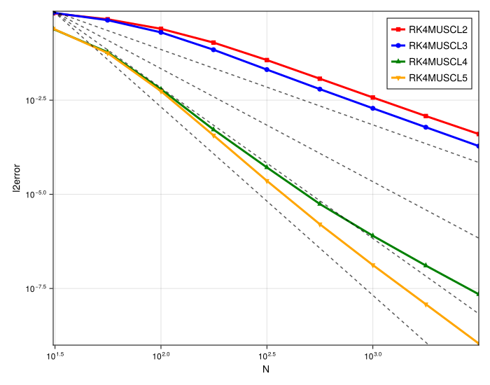

# 1D MUSCL Convergence Order Study (Smooth Flow)

## Introduction

This document analyzes the spatial convergence order of high-order 1D MUSCL schemes (orders 2, 3, 4, and 5) for a smooth linear advection problem. The study is divided into two parts to distinguish between the spatial discretization error and the temporal integration error.

1.  **CFL-Limited Timestepping**: Uses a 4th-order Runge-Kutta (RK4) timestepper with a fixed CFL number. This means `dt` is proportional to `dx` (or `1/N`), and the total error `O(dt^4, dx^p)` is limited by the *minimum* of the two, `O(N^{-min(4, p)})`.
2.  **Fixed (Small) Timestepping**: Uses a very small, fixed `dt` (`1.0e-5`) to make the `O(dt^4)` time error negligible. This isolates the spatial convergence order `O(dx^p)` or `O(N^{-p})`.

## Experimental Setup

-   **PDE**: 1D Linear Advection (`linear`)
-   **Initial Condition**: Gaussian Pulse (`init_func = gauss`)
-   **Max Time (`tmax`)**: `10.0`
-   **Timestepper**: 4th Order Runge-Kutta (`RK4`)
-   **Methods**:
    -   `RK4MUSCL2` (2nd Order)
    -   `RK4MUSCL3` (3rd Order)
    -   `RK4MUSCL4` (4th Order)
    -   `RK4MUSCL5` (5th Order)
-   **Reference Lines**: Slopes for 2nd, 3rd, 4th, and 5th order convergence are plotted for comparison.

---

## Observation of Plots

### 1. CFL-Limited Timestepping

In this test, the `RK4` timestepper limits the maximum achievable convergence order to 4.

-   **`RK4MUSCL2`**: Achieves its designed 2nd order convergence, matching the `O(2)` reference line.
-   **`RK4MUSCL3`**: Fails to achieve 3rd order. Its convergence slope is parallel to the `O(2)` reference line.
-   **`RK4MUSCL4`**: Achieves its designed 4th order convergence, matching the `O(4)` reference line.
-   **`RK4MUSCL5`**: Is limited by the timestepper. Its convergence slope matches the `O(4)` reference line, not the `O(5)` line.

### 2. Fixed (Small) Timestepping

This test removes the time-stepping error, revealing the true spatial convergence order.

-   **`RK4MUSCL2`**: Correctly shows 2nd order convergence.
-   **`RK4MUSCL4`**: Correctly shows 4th order convergence.
-   **`RK4MUSCL5`**: Now that it is no longer limited by the `RK4` timestepper, the scheme successfully achieves its designed (or near) 5th order convergence, matching the `O(5)` reference line.
-   **`RK4MUSCL3`**: This scheme **still shows only 2nd order convergence**. Its slope remains parallel to the `O(2)` line, proving the issue is with the spatial discretization, not the timestepper.
-   **`MUSCL3` vs `MUSCL2`**: A key observation is that while `RK4MUSCL3` is only 2nd order, its error line is *consistently lower* than the `RK4MUSCL2` line.

---

## Analysis

This two-part study successfully isolates and identifies the convergence orders of the spatial schemes.

1.  **`MUSCL5` is Time-Step Limited (as expected)**: The first plot clearly shows that `RK4MUSCL5` was being held back by the `RK4` timestepper. When the time error was removed in the second plot, the scheme's true 5th order spatial accuracy was revealed.

2.  **`MUSCL2` and `MUSCL4` are Correct**: Both `RK4MUSCL2` and `RK4MUSCL4` perform exactly as designed, achieving their respective 2nd and 4th convergence orders.

3.  **`MUSCL3` has a Spatial Order Defect**: The most significant finding is the pathology in the 3rd order method.
    -   Since `RK4MUSCL3` failed to achieve 3rd order *even with a negligible time-step*, the problem lies in the spatial formulation.
    -   The implementation of `MUSCL3` appears to be only 2nd order accurate.
    -   However, as you noted, it *does* provide an improvement over `MUSCL2` by having a **smaller error constant**, even if its asymptotic convergence rate is the same.
