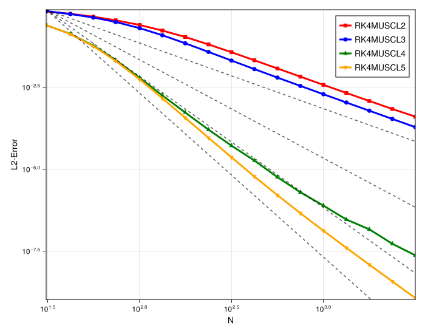

# 1D MUSCL Convergence Order Study (Smooth Flow, High-Res)

## Introduction

This document analyzes the spatial convergence order of high-order 1D MUSCL schemes (orders 2, 3, 4, and 5) for a smooth linear advection problem. This high-resolution study uses a very small CFL number (0.01) to ensure the `O(dt^4)` temporal error is negligible, thereby isolating the true spatial convergence order of each scheme.

This analysis supersedes previous studies that used a larger CFL number or fixed `dt`.

## Experimental Setup

-   **PDE**: 1D Linear Advection (`linear`)
-   **Initial Condition**: Gaussian Pulse (`init_func = gauss`)
-   **Max Time (`tmax`)**: `10.0`
-   **Timestepper**: 4th Order Runge-Kutta (`RK4`)
-   **Timestepping**: CFL-based, with a very small `CFL = 0.01`
-   **Methods**:
    -   `RK4MUSCL2` (2nd Order)
    -   `RK4MUSCL3` (3rd Order)
    -   `RK4MUSCL4` (4th Order)
    -   `RK4MUSCL5` (5th Order)
-   **Reference Lines**: Slopes for 2nd, 3rd, 4th, and 5th order convergence are plotted for comparison.

---

## Observation and Analysis

The plot from this high-resolution, low-CFL simulation provides a clear picture of the spatial convergence orders.

1.  **`RK4MUSCL2`**: Achieves its designed **2nd order** convergence, matching the `O(2)` reference line.

2.  **`RK4MUSCL3`**: Fails to achieve 3rd order. Its convergence slope is **only marginally steeper than 2nd order** and remains parallel to the `RK4MUSCL2` line. This confirms the finding from previous studies that the 3rd-order spatial implementation has an order defect, performing as a 2nd-order scheme.

3.  **`RK4MUSCL4`**: Achieves its designed **4th order** convergence, matching the `O(4)` reference line.

4.  **`RK4MUSCL5`**: With the time error now negligible, the `RK4MUSCL5` scheme is no longer capped at 4th order. It demonstrates a **small but measurable convergence rate increase over the 4th order scheme**, with its slope running between  the `O(4)` and `O(5)` reference lines. This confirms the scheme's spatial order is indeed higher than 4.

## Conclusion

This study shows a grouping of the methods based on their *actual* spatial convergence order:

-   **Group 1 (2nd Order)**: `RK4MUSCL2` and `RK4MUSCL3`. The 3rd-order scheme shows a persistent spatial order defect.
-   **Group 2 (4th/5th Order)**: `RK4MUSCL4` and `RK4MUSCL5`. Both schemes achieve a high order convergence of over 4, with the 5th-order scheme showing a slight, but clear, advantage in convergence rate over the 4th-order one.
