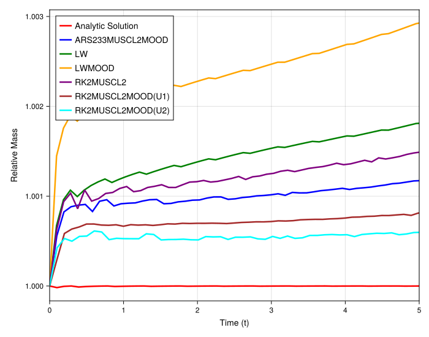
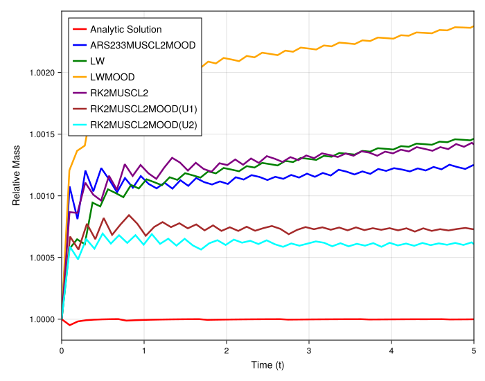

# Quantitative Analysis of Mass Conservation for a Rarefaction Wave

## Introduction

This experiment quantitatively analyzes the mass conservation properties of the high-resolution schemes for a smooth, expanding rarefaction wave. Unlike the previous shock-capturing tests where significant, scheme-dependent mass loss was observed, this study investigates the much smaller mass variations that can occur even for smooth solutions. The goal is to determine if the non-conservative behavior of the MOOD/WENO schemes persists for smooth profiles and to characterize the nature of any observed mass change.

## Experimental Setup

The simulation solves the 1D inviscid Burgers' equation on a uniform grid. Two scenarios with different initial step heights are tested to see if the downstream value affects the outcome, analogous to the previous shock experiment.

### Scenario 1: Rarefaction (0 to 1)
- **Initial Condition**: Rarefaction from -1 to 1
- **Domain**: `[-4, 4]`
- **Final Time (`tmax`)**: 5.0
- **Particles (`N`)**: 100
- **Grid**: Uniform
- **Methods**:
    - `MUSCL-Superbee`
    - `MUSCL-VK`
    - `MOOD`
    - `WENO`
- **Note**: All methods use the `ARS233` IMEX timestepper.

### Scenario 2: Small Step Rarefaction (0.5 to 1)
- **Initial Condition**: Rarefaction from 0.5 to 1
- **Domain**: `[-4, 4]`
- **Final Time (`tmax`)**: 5.0
- **Particles (`N`)**: 200
- **Grid**: Uniform
- **Methods**: `MOOD` and `WENO`
- **Note**: Both methods use the `ARS233` IMEX timestepper.

---

## Observation of Plots

### Rarefaction Wave (0 to 1)

- All four schemes (`MUSCL-Superbee`, `MUSCL-VK`, `MOOD`, `WENO`) exhibit a very small, gradual increase in mass over time.
- The magnitude of the mass change is extremely small (on the order of $10^{-5}$), which is why it was not visible in the solution plots.
- All methods behave almost identically, with their mass-over-time curves closely overlapping.

### Small Step Rarefaction (0.5 to 1)

- The `MOOD` and `WENO` schemes again show a very small increase in total mass over time.
- The rate and magnitude of mass increase are comparable to the -1 to 1 rarefaction case, despite the different initial conditions and final time.

---

## Analysis

The results for the rarefaction wave show a fundamentally different behavior regarding mass conservation compared to the shock-capturing cases.

- **Negligible Mass Change**: The observed mass increase is several orders of magnitude smaller than the mass loss seen in the shock experiments. This minor deviation is typical of high-order numerical schemes and can be attributed to the accumulation of floating-point errors and the discretization error of the non-conservative, point-wise formulation. Crucially, the mass change is not significant enough to visibly affect the solution's accuracy.

- **Mechanism is Independent of MOOD/WENO**: Unlike the shock-capturing case, the mass change here is not specific to the `MOOD` and `WENO` schemes. All methods, including the limiter-based `MUSCL` schemes, show the same behavior. This indicates that the dissipative `MOOD` fallback mechanism is not being triggered for this smooth solution, and the observed effect is a baseline property of the underlying meshfree spatial discretization.

- **Independence from Downstream Value**: The fact that the mass change is similar for both the -1 to 1 and 0.5 to 1 rarefaction waves further supports a different underlying mechanism. It shows that this small mass increase is unrelated to the "zero-value" problem that caused severe mass loss at shocks. Instead, it appears to be a small, systematic bias in the meshfree divergence approximation for this type of expanding flow profile.