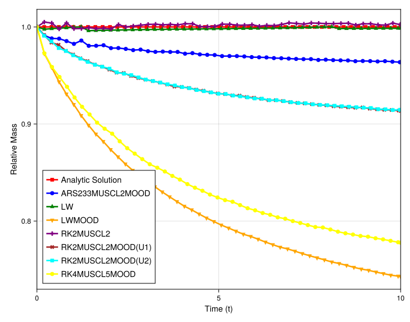

# Quantitative Analysis of Mass Loss in Burgers' Equation Simulations

## Introduction

This experiment provides a quantitative analysis of the mass conservation properties of the implemented high-resolution schemes. Building on the previous qualitative observation of mass loss for the `MOOD` and `WENO` methods, this study tracks the total mass (the integral of the solution) over time. The goal is to measure the rate of mass loss, confirm its origin, and investigate strategies for its mitigation.

## Experimental Setup

The simulation solves the 1D inviscid Burgers' equation on a periodic domain. Two primary scenarios are tested to diagnose the non-conservative behavior.

### Scenario 1: Small Step (1 to 0.5) on a Uniform Grid
This test uses a non-zero downstream value to investigate the inherent dissipation of the MOOD mechanism itself.
- **Initial Condition**: Step from 1.0 to 0.5
- **Domain**: `[-4, 4]`
- **Final Time (`tmax`)**: 8.0
- **Particles (`N`)**: 300
- **Grid**: Uniform
- **Methods**:
    - `ARS-MUSCL2-MOOD`: Meshfree MUSCL with `ARS222` (IMEX) timestepper.
    - `SS-MUSCL2-MOOD`: Meshfree MUSCL with `SimpleSplitting` timestepper.
    - `LW-MOOD`: A classical (non-meshfree) Lax-Wendroff scheme with MOOD.
    - `RK5-MOOD`: A 5th order scheme with MOOD.

### Scenario 2: Shock (1 to 0) on an Irregular Grid
This is a more challenging test case corresponding to the solution plots from the previous experiment.
- **Initial Condition**: Step from 1.0 to 0 (`init_func: box`)
- **Domain**: `[-5, 5]`
- **Final Time (`tmax`)**: 10.0
- **Particles (`N`)**: 300
- **Grid**: Irregular (`randomness_factor: 0.2`)
- **Methods**:
    - `MUSCL-Superbee`
    - `MUSCL-VK`
    - `MOOD`
    - `WENO`
- **Note**: All methods in this scenario use the `ARS222` IMEX timestepper.

---

## Observation of Plots

### Small Step Profile (1 to 0.5)

_smallstep.svg)

- All tested MOOD-based methods exhibit a slow, near-linear loss of mass over time.
- The zoomed plot reveals that the three meshfree MOOD schemes (`ARS-MUSCL2-MOOD` and `RK2-MUSCL2-U1/U2`) have virtually identical rates of mass loss, which are the highest among the tested methods.
- The non-meshfree `LW-MOOD` and the higher-order `RK5-MOOD` schemes also lose mass, but at a noticeably lower rate.

### Shock Profile (1 to 0) on an Irregular Grid

- The limiter-based schemes, `MUSCL-Superbee` and `MUSCL-VK`, demonstrate excellent mass conservation, with the total mass remaining nearly constant throughout the simulation.
- The `MOOD` and `WENO` schemes show significant and continuous mass loss. The rate of loss is much more severe than in the "small step" case, with several percent of the initial mass lost by the final time.

---

## Analysis

The quantitative data confirms that the mass loss is primarily caused by the dissipative nature of the *a posteriori* limiting in `MOOD` and `WENO`, especially when interacting with zero-valued solution regions.

- **MOOD Mechanism as the Source of Mass Loss**: The "small step" experiment effectively isolates the `MOOD` mechanism as a source of non-conservation. The inclusion of the `LW-MOOD` scheme, a classical finite difference method on a uniform grid, confirms that the mass loss is not an artifact of the meshfree spatial discretization. Instead, it is inherent to the `MOOD` logic itself. When the `MOOD` criterion is triggered at a shock, the scheme falls back to a first-order upwind update, which is dissipative. This local dissipation clips the solution profile, leading to a net loss of the conserved quantity.

- **The "Zero-Value" Problem**: The drastic difference in mass loss between the "small step" (1 to 0.5) and the "shock" (1 to 0) scenarios confirms the critical role of the downstream state. When the dissipative fallback acts at the foot of a shock moving into a zero-valued region, it effectively removes mass from the system. When the downstream value is non-zero, the dissipation acts more like a local averaging or smoothing, which significantly mitigates the net loss.

- **Benefit of Relaxation (IMEX) Methods for MOOD**: A key takeaway from the full suite of experiments is that relaxation-based time integrators like `ARS222` are preferable when using `MOOD`. While all MOOD methods lose mass, the IMEX schemes consistently show substantially smaller losses for the 1-to-0 shock compared to direct explicit methods. The implicit part of the IMEX solve has a stabilizing effect, reducing the tendency of the high-order explicit step to produce oscillations. This means the `MOOD` criterion is triggered less frequently or less severely, leading to a smaller cumulative mass loss from the dissipative fallback over time.

- **Conservation of Limiter-Based Schemes**: In contrast, the `MUSCL-Superbee` and `MUSCL-VK` schemes, which rely on *a priori* slope limiting, prove to be robustly conservative in this test. Their limiting action modifies the reconstruction slopes to prevent oscillations but does not systematically remove mass in the same way the `MOOD` fallback does, demonstrating that the underlying meshfree divergence approximation can preserve mass effectively when paired with a suitable limiter.