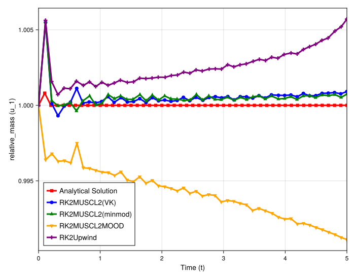
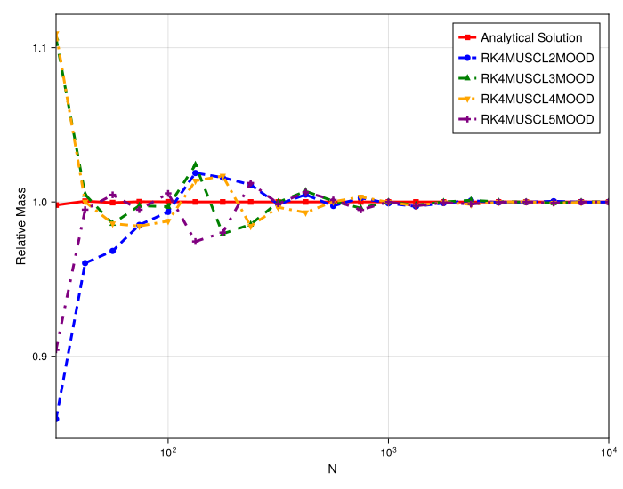

# 1D Burgers' Mass Conservation Study (Rarefaction Wave)

## Introduction

This document provides the final quantitative analysis, investigating the mass conservation of a 1D Burgers' **rarefaction wave**. This study is the crucial counterpart to the shock problem. It combines a time-evolution plot and a resolution-convergence plot to definitively determine the nature of the conservation errors.

## Experimental Setup

-   **PDE**: 1D Burgers' (`burgers`)
-   **Initial Condition**: Rarefaction Wave (`riemann`)
-   **Methods**: `Limiter` (VK) and `MOOD` (orders 2, 3, 4, 5) variants.
-   **Timestepper**: `RK4` (Direct)

---

## Part 1: Mass vs. Time Analysis

### Observations

This plot looks fundamentally different from the shock-tube problem.

-   **No Systematic Error**: There is no systematic, one-sided mass loss. The `MOOD` schemes (yellow, green, orange, purple) do not continuously drop below 1.0.
-   **Diffusion-Based Error**: All methods, including the `Limiter` and all `MOOD` variants, show a small **mass *gain***. This behavior, where the error is related to numerical diffusion (rather than a systemic failure), is typical for meshfree schemes on smooth flows.
-   **Conclusion**: The `MOOD` scheme's mass loss pathology does not appear for this smooth rarefaction wave.

---

## Part 2: Mass vs. Resolution (N) Analysis

This plot provides the definitive proof. It shows the relative mass at a fixed time as the resolution `N` is increased.

### Observations

-   **Convergence to 1.0**: This is the key finding. **All methods**, including the entire `MOOD` suite (`RK4MUSCL2MOOD`, `3`, `4`,Signature: `5`) and the `Limiter` scheme, **correctly converge to a relative mass of 1.0**.

---

## Final Conclusion

This study provides the final, critical piece of the analysis:

The non-conservative, systematic mass loss observed in all `MOOD` schemes is **exclusively a shock-capturing pathology**.

When applied to a smooth flow like a rarefaction, the `MOOD` scheme is **fully conservative** (in the limit) and behaves just as well as the robust `Limiter` schemes. This confirms that the `MOOD` implementation itself is not fundamentally flawed, but its *triggering mechanism* in the presence of discontinuities leads to a systematic violation of conservation.