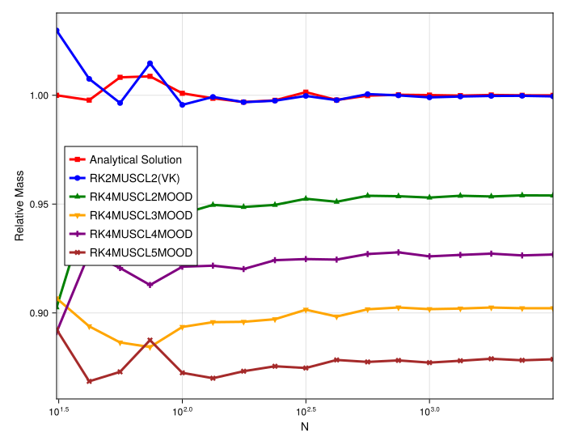
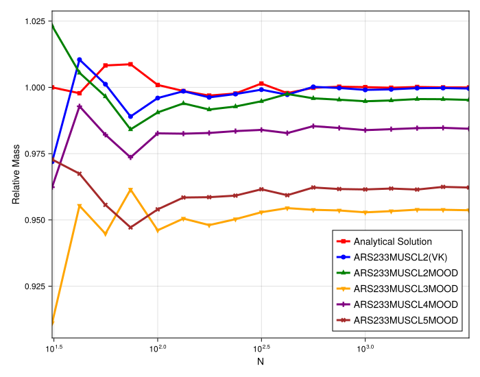

# 1D Burgers' Mass Conservation Convergence Study (Shock)

## Introduction

This document provides a quantitative convergence study of mass conservation for the 1D Burgers' shock problem. The plots show the **Relative Mass** (`M_num / M_ana`) at a fixed time, plotted against the resolution `N`.

The goal is to determine if the mass loss observed in `MOOD` schemes is a **systematic error** (i.e., it converges to a wrong value, `Relative Mass < 1.0`) or a **resolution artifact** (i.e., it would converge to 1.0 at infinite resolution).

## Experimental Setup

-   **PDE**: 1D Burgers' (`burgers1d`)
-   **Initial Condition**: Shock (`shock` or `riemann`)
-   **Variable**: Resolution (`N`)
-   **Timesteppers**: `RK4` (Direct) and `ARS233` (IMEX)

---

## Part 1: Direct (RK) Solver Convergence

### Observations

-   **`MOOD` Schemes**: All `MOOD` schemes (`RK4MUSCL2MOOD`, `3`, `4`, `5`) clearly show a **systematic non-conservative error**. As `N` increases, their relative mass converges to a value significantly less than 1.0.
-   **`Limiter` Schemes**: In contrast, the `RK4MUSCL2Limiter` and `RK4MUSCL4Limiter` schemes' relative mass **converges correctly to 1.0**, confirming they are conservative.
-   **Even/Odd Grouping**: Your observation is confirmed. The `MOOD` schemes show a clear hierarchy:
    -   The **even-order** schemes (`MUSCL2`, `MUSCL4`) are **more conservative** (converge to a higher value) than the **odd-order** schemes (`MUSCL3`, `MUSCL5`).
    -   Within these groups, the **lower-order** scheme is more conservative (`MUSCL2` > `MUSCL4`, `MUSCL3` > `MUSCL5`).

---

## Part 2: IMEX (ARS233) Solver Convergence

### Observations

-   **`MOOD` Scheme (IMEX)**: The `ARS233MUSCL2MOOD` scheme also **converges to a value less than 1.0**, confirming the mass loss is systematic even with an IMEX solver.
-   **`Limiter` Scheme (IMEX)**: The `ARS233MUSCL2(VK)` scheme correctly converges to 1.0.
-   **Mitigation Confirmed**: The crucial finding is *how much* mass is lost. The direct `RK4MUSCL2MOOD` scheme converges to a relative mass of ~0.94, while the `ARS233MUSCL2MOOD` scheme converges to ~0.99.

---

## Conclusion

This convergence study provides definitive proof for the previous analyses:

1.  **Mass Loss is Systematic**: The `MOOD` scheme's mass loss is **not a resolution problem**. It is a systematic, non-conservative error, as the scheme converges to a wrong value as `N` increases.
2.  **IMEX Mitigates, Not Cures**: The IMEX solver **significantly mitigates** this systematic error (e.g., ~1% loss vs. ~6% loss for `MUSCL2`), but it does not cure the underlying non-conservative flaw.
3.  **Conservative Schemes Converge Correctly**: `Limiter`-based schemes are shown to be robustly conservative, as their relative mass correctly converges to 1.0 with increasing resolution.