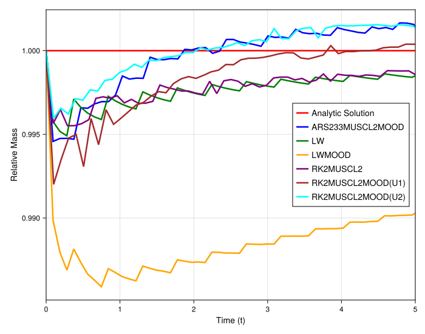
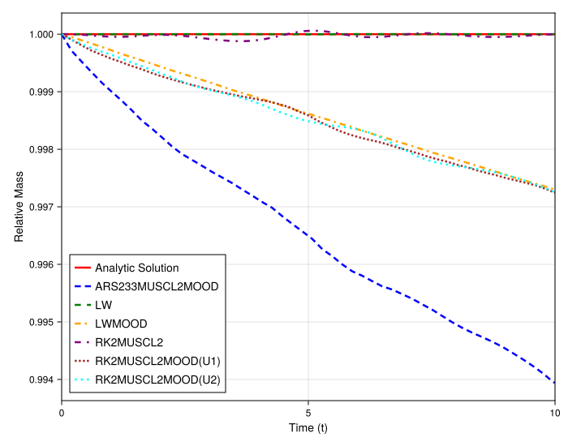
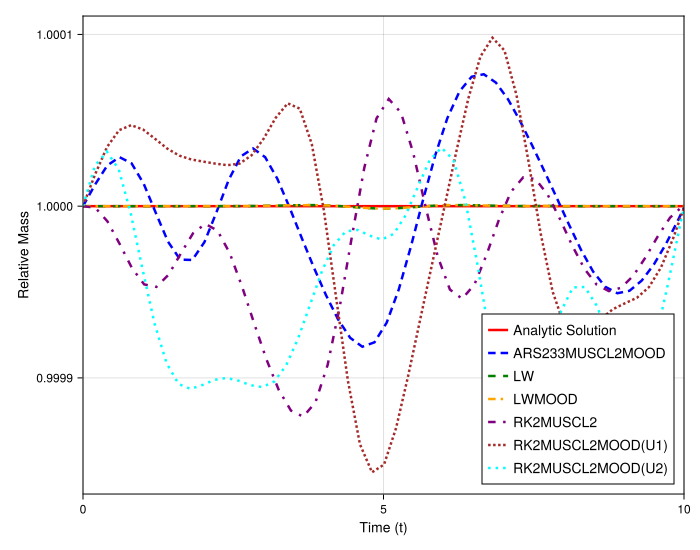

### Numerical Experiment: Mass Conservation for the Linear Advection Equation

This experiment analyzes the mass conservation properties of the various schemes for the linear advection equation. The goal is to contrast this behavior with the results from the nonlinear Burgers' equation, particularly concerning the effects of the MOOD framework and the performance of relaxation schemes on irregular grids.

#### Experimental Setup

The test problem is the one-dimensional linear advection equation, $u_t + a u_x = 0$. The simulations are performed on irregular grids (`randomness_factor > 0`) to assess the robustness of the methods. We investigate two distinct scenarios: a discontinuous initial condition (a Riemann problem) to test the schemes' behavior at sharp fronts, and a smooth initial condition (a Gaussian pulse) to evaluate their baseline conservation error in non-challenging cases. The `relative_mass` is plotted over time, where a value of 1.0 indicates perfect mass conservation.

#### Observations and Analysis

##### Case 1: Discontinuous Initial Condition (Riemann Problem)

For the Riemann problem, the MOOD-stabilized schemes are necessary to prevent the large, non-physical oscillations that would otherwise occur.
* **Observation:** The plot shows that all stabilized methods exhibit some degree of mass loss over time. The classical `LWMOOD` scheme is the most dissipative, while the meshfree MOOD schemes (`ARS233MUSCL2MOOD`, `RK2MUSCL2MOOD`, etc.) perform significantly better, keeping the mass loss within about 1-2%.
* **Analysis:** As with the Burgers' equation, this mass loss is an artifact of the **non-conservative mixing** of fluxes when the MOOD framework switches between the high-order and low-order schemes to stabilize the discontinuity. However, it is crucial to note that the magnitude of mass loss is **much smaller** than that observed for the Burgers' shock wave. This is because the linear advection of a step function does not generate the same kind of strong, nonlinear oscillations in the candidate solution, leading to less frequent and less aggressive intervention by the MOOD detector.

##### Case 2: Smooth Initial Condition (Gaussian Pulse)

For the smooth Gaussian initial condition, the behavior is markedly different.
* **Observation:** All methods, including those with MOOD enabled, demonstrate excellent mass conservation. The relative mass for all schemes remains very close to the ideal value of 1.0, with deviations on the order of numerical precision.
* **Analysis:** This result confirms that the MOOD criteria are working as intended. They correctly identify the smooth Gaussian as a non-problematic solution and remain "dormant," allowing the underlying high-order schemes to run without intervention. Consequently, no non-conservative mixing occurs, and the schemes exhibit their inherent, excellent conservation properties.

#### Direct vs. Relaxation Methods for Linear Advection

The comparison between the direct and relaxed MOOD schemes for the smooth case is particularly insightful.
* **Observation:** The plot shows that both direct (`RK2MUSCL2MOOD(U1)`) and relaxed (`RK2MUSCL2MOOD(U1Relax)`) methods are highly conservative.
* **Analysis:** You correctly noted that for linear advection, the relaxation scheme is a particularly good approximation. The condition that the relaxed fluxes match the physical flux, $\sum_k a_k M_k(u) = a \cdot u$, can be satisfied with high precision. As a result, the relaxation method effectively reproduces the behavior of the underlying high-order meshfree scheme (`MUSCL2`). The small amount of mass error observed in the relaxed versions is essentially the baseline numerical error of the spatial discretization itself. This contrasts sharply with the Burgers' equation case, where the primary benefit of the relaxation method was to present a simpler, linear problem to the MOOD detector to *reduce non-conservative mixing at the shock*. Here, since no mixing occurs, both direct and relaxed methods perform nearly perfectly.

#### Conclusion

For the linear advection equation, mass loss is primarily a concern for discontinuous problems where stabilization is required. The non-conservative mixing introduced by MOOD is the source of this error, though it is significantly less severe than for the nonlinear Burgers' shock. For smooth problems, the MOOD framework correctly remains inactive, and all high-order schemes demonstrate excellent mass conservation, with the relaxation method providing a very accurate and stable implementation of the underlying high-order spatial discretization.