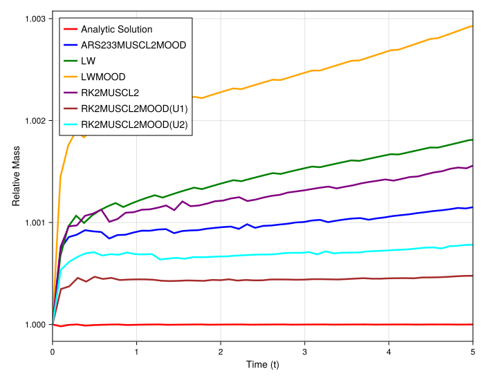

### Numerical Experiment: Mass Conservation for Burgers' Equation with a Rarefaction Wave

To complement the analysis of the shock wave, this experiment investigates the mass conservation properties of the various schemes when solving the inviscid Burgers' equation for an initial condition that evolves into a smooth rarefaction wave. A key goal is to verify that the MOOD framework, which is designed to activate at sharp gradients, remains largely dormant for this smooth solution and does not introduce the non-conservative mixing observed in the shock wave case. The simulations are again performed on irregular grids to test the robustness of the methods.

#### Experimental Setup

The test problem is the inviscid Burgers' equation, $u_t + (\frac{1}{2}u^2)_x = 0$. The initial condition is a Riemann problem with a left state $u_L$ lower than the right state $u_R$, which is known to evolve into a smooth, expanding rarefaction fan. As in the previous experiment, we test two cases: a large rarefaction (jump from 0.0 to 1.0) and a smaller one (jump from 0.5 to 1.0). The simulations are run on an irregular grid, and the `relative_mass` is plotted over time.

#### Observations

The figures show the evolution of the relative mass over time for the two different rarefaction strengths.

##### Case 1: Large Rarefaction (Jump from 0.0 to 1.0)

For the large rarefaction, the results are remarkably different from the shock wave case. All tested numerical methods, including the high-order `LW` and the various `RK2MUSCL2MOOD` schemes, exhibit nearly perfect mass conservation. The relative mass for all methods remains clustered around the ideal value of 1.0 throughout the simulation.

##### Case 2: Small Rarefaction (Jump from 0.5 to 1.0)

The results for the smaller rarefaction wave confirm the previous observation. All methods show excellent mass conservation, with the relative mass staying very close to 1.0. There is no significant difference in performance between the schemes with MOOD activated and those without.

#### Analysis and Conclusion

This experiment effectively demonstrates the "intelligence" of the MOOD framework and highlights the specific nature of the mass conservation issue.

1.  **MOOD is Inactive for Smooth Solutions:** The central finding is that for a rarefaction wave, which is a smooth solution to the Burgers' equation, the MOOD criteria are not triggered. The candidate solution generated by the high-order base scheme (`RK2MUSCL2`) is accepted by the MOOD detector at every cell. As a result, the scheme runs as a purely high-order method, and no non-conservative mixing between schemes occurs.

2.  **Conservation is a Shock-Related Problem:** Comparing these results to the shock wave experiment makes it clear that the significant mass loss observed previously is not an inherent flaw of the MOOD framework itself, but a consequence of its interaction with sharp, non-physical oscillations generated by the high-order scheme at discontinuities. When the solution is smooth, as in the rarefaction case, the high-order scheme is non-oscillatory, MOOD remains inactive, and mass is conserved.

In conclusion, this test validates that the MOOD framework is working as designed. It correctly distinguishes between a smooth, physically admissible solution (a rarefaction wave) and a solution prone to spurious oscillations (a shock wave), applying the corrective (but non-conservative) fallback only when necessary. This confirms that the observed mass loss is a localized phenomenon directly coupled to the stabilization of shock waves.