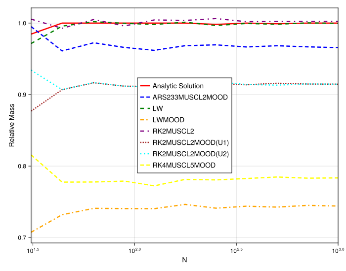
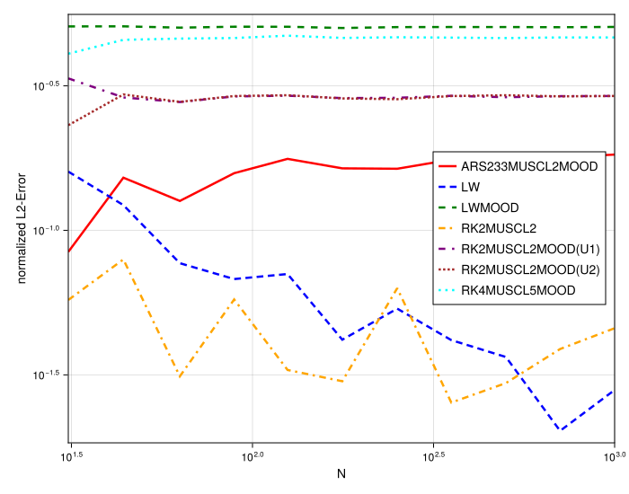
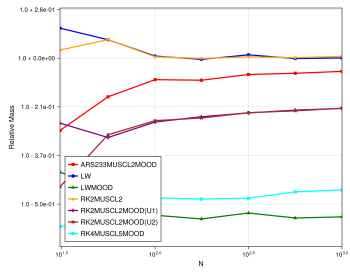

### Numerical Experiment: Convergence and Mass Conservation for Shock Waves

This experiment investigates the behavior of the numerical schemes when applied to the nonlinear Burgers' equation with initial conditions that evolve into shock waves. The primary goals are to assess how the mass conservation and the L2 error of the solution change as the spatial resolution (`N`) is increased. For problems with smooth solutions, we expect the error to decrease predictably with `N`. For problems with shocks, the behavior is more complex.

The simulations are performed on irregular grids (`randomness_factor > 0`) to test the methods' robustness. The study involves running simulations for each method across a range of particle counts `N`. At a fixed final time, two key metrics are recorded: the `relative_mass` and the `normalized L2-Error`.

#### Case 1: Riemann Problem Initial Condition

First, we consider a classic Riemann problem which immediately forms a single traveling shock wave.

##### Mass Conservation vs. Spatial Resolution (Riemann)

The first figure shows the relative mass of the final solution as a function of `N`.
* **Observation:** For the MOOD-stabilized schemes (e.g., `ARS233MUSCL2MOOD`, `RK2MUSCL2MOOD`), the relative mass is not 1.0, indicating a loss of mass. Crucially, after an initial transient at very low resolutions, the amount of mass loss becomes **largely independent of the spatial resolution**. For `N > 100`, the lines become nearly flat. The more oscillatory underlying schemes, like `LWMOOD` and `RK4MUSCL5MOOD`, settle at a much lower relative mass, indicating more severe conservation issues.
* **Analysis:** This result demonstrates that the mass loss, which is caused by the non-conservative mixing of fluxes when the MOOD criterion triggers a switch at the shock front, is a local phenomenon tied to the structure of the shock itself. Refining the grid does not reduce this error.

##### L2-Error vs. Spatial Resolution (Riemann)

The second figure shows the normalized L2 error on a log-log scale.
* **Observation:** In stark contrast to the smooth test cases, **none of the methods show a clear order of convergence**. The error lines are highly oscillatory and do not follow a straight line with a consistent negative slope.
* **Analysis:** This behavior is a direct consequence of solving a problem with a moving discontinuity. The L2 error is dominated by the error in the shock's position and width. Small, grid-dependent variations in the shock's location from one resolution `N` to the next can cause large, noisy fluctuations in the integrated L2 error. This, combined with the non-converging conservation error, prevents classical convergence.

#### Case 2: Box Initial Condition

To confirm that this behavior is characteristic of shocks in general, we now consider a box initial condition (a "top-hat"), which evolves into a rarefaction wave on the left and a shock wave on the right.

##### Mass Conservation vs. Spatial Resolution (Box)

The third figure shows the relative mass for the box initial condition.
* **Observation:** The results are qualitatively identical to the Riemann problem. After an initial transient phase for low `N`, the mass loss for each MOOD-stabilized scheme settles to a constant level that does not improve with further grid refinement.
* **Analysis:** This confirms the previous finding. The mass loss is tied to the presence of the shock wave. The numerical scheme correctly resolves the smooth rarefaction part of the solution, but the stabilization required for the shock front consistently introduces a similar amount of non-conservative mixing, regardless of the number of particles.

#### Conclusion

This experiment demonstrates two fundamental properties of the MOOD-stabilized meshfree schemes when applied to nonlinear problems with shocks:

1.  **Mass loss due to the stabilization mechanism is independent of grid resolution.** The non-conservative mixing at a shock front is an inherent feature of the method, and simply using more points does not eliminate this source of error. This results in a zeroth-order error in mass conservation.
2.  **Classical convergence analysis is not meaningful for shocked flows.** The L2 error is dominated by the shock's position and the non-converging conservation error. This leads to erratic, non-convergent error plots.

The primary goal for such problems is not to achieve a specific order of convergence, but to produce a stable, sharp, and correctly located shock wave. The MOOD framework successfully achieves this, but as this analysis shows, it comes at the cost of formal convergence and perfect conservation.