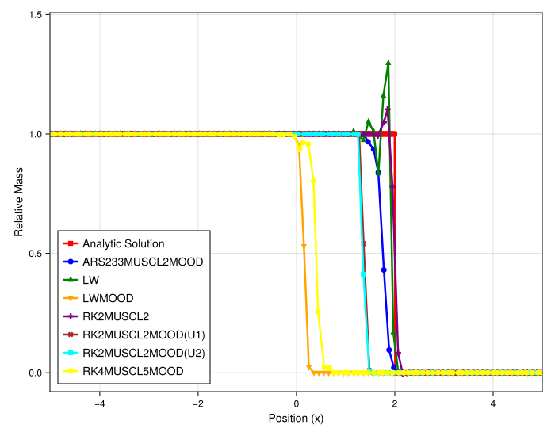
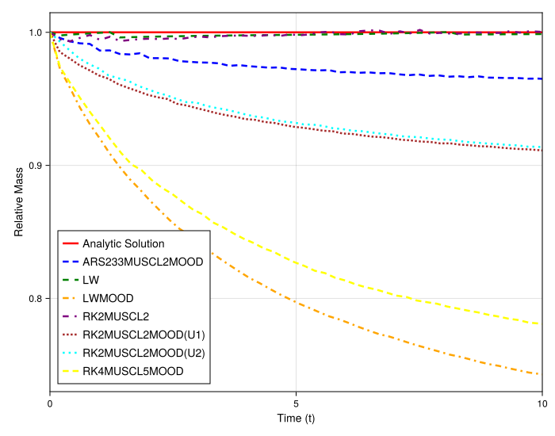
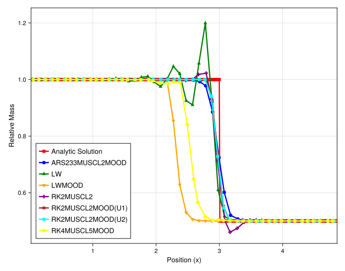
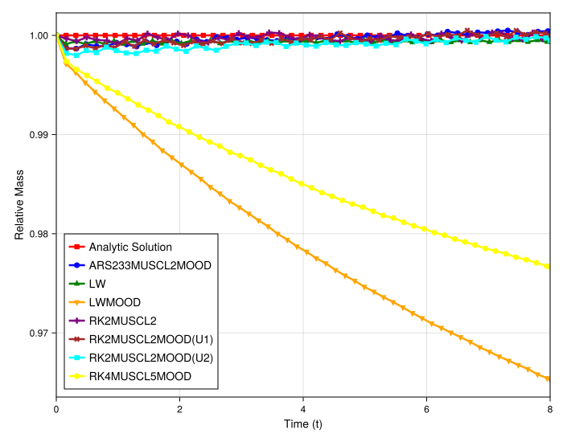

### Numerical Experiment: Mass Conservation for Burgers' Equation with a Shock

While high-order accuracy is desirable for smooth problems, for nonlinear problems involving shock waves, a crucial property of a numerical scheme is its ability to conserve fundamental quantities like mass. This experiment investigates the mass conservation properties of various schemes when solving the inviscid Burgers' equation with a shock wave. A key aspect of this test is the use of **irregular grids** (`randomness_factor > 0`), which challenges the robustness of the methods.

#### Experimental Setup

The test problem is the inviscid Burgers' equation, $u_t + (\frac{1}{2}u^2)_x = 0$. The initial condition is a Riemann problem that forms a shock wave. We test two different shock strengths: a large jump from $u_L=1.0$ to $u_R=0.0$, and a smaller jump from $u_L=1.0$ to $u_R=0.5$. The simulation is run on an irregular grid to assess the performance in a more realistic, non-ideal setting.

The primary metric for this analysis is the `relative_mass`, calculated as the total mass of the numerical solution at time $t$ divided by the initial mass. For a perfectly conservative scheme, this value should remain exactly 1.0 for all time.

#### Rationale for Method Selection

This study is designed to compare how different stabilization strategies and numerical formulations affect mass conservation in the presence of a shock on an irregular grid.
1.  **High-Order Schemes (`LW`, `RK4MUSCL5MOOD`):** These are included to test the hypothesis that more oscillatory high-order methods might lead to poorer conservation when stabilized.
2.  **MOOD-Stabilized Schemes:** The core of the analysis is on the `ARS233MUSCL2MOOD` and various `RK2MUSCL2MOOD` methods. Since both the high-order and low-order components are conservative on their own, any mass loss is a direct result of the non-conservative mixing that occurs when the MOOD framework switches between them.
3.  **Direct vs. Relaxation Methods:** A key comparison is made between direct solvers and their relaxation-based counterparts (e.g., `RK2MUSCL2MOOD(U1)` vs. `RK2MUSCL2MOOD(U1Relax)`). This tests whether reformulating the problem into a semi-linear system can improve conservation.

#### Observations

The figures show the evolution of the relative mass over time for the two different shock strengths.

##### Case 1: Large Shock (Jump from 1.0 to 0.0)

The solution plot confirms that all MOOD-stabilized methods produce sharp, non-oscillatory shock profiles, while the unlimited high-order schemes (not shown) would be unstable. The mass conservation plot, however, reveals significant differences.
* **High-Order Schemes (`LW`, `RK4MUSCL5MOOD`):** The classical Lax-Wendroff and the high-order meshfree method exhibit the most severe mass loss, with the relative mass decaying to nearly 0.75. This is because their underlying tendency to produce large oscillations at the shock front forces the MOOD detector to intervene heavily, leading to frequent and widespread non-conservative mixing.
* **Second-Order MOOD Schemes:** The second-order MOOD schemes perform better but still show a clear loss of mass over time.
* **Effect of Shock Strength:** The mass loss is significant for this strong shock.

##### Case 2: Small Shock (Jump from 1.0 to 0.5)

_smallstep.svg)

For the weaker shock, the mass loss is substantially reduced for all methods.
* The zoomed-in plot shows that the mass loss for the best methods is now less than 0.1%.
* **Relaxation Method Superiority:** The most striking result is the clear difference between the direct and relaxation methods. The direct MOOD schemes (e.g., `RK2MUSCL2MOOD(U1)`, orange) show small but noticeable oscillations in their mass calculation. In contrast, the relaxation-based MOOD schemes (e.g., `ARS233MUSCL2MOOD`, blue) are significantly better, maintaining a relative mass much closer to the ideal value of 1.0.

#### Analysis and Conclusion

This experiment provides several key insights into the behavior of stabilized schemes for nonlinear problems.

1.  **Mass Loss from Non-Conservative Mixing:** The primary source of mass loss is the non-conservative mixing of fluxes that occurs when the MOOD framework applies different spatial discretizations (high-order vs. low-order fallback) to adjacent cells at the shock front.
2.  **Dependence on Shock Strength and Scheme Order:** The amount of mass loss is directly related to how much the MOOD scheme is forced to intervene. Stronger shocks and more inherently oscillatory high-order base schemes (like `LW` and `RK4MUSCL5`) produce larger candidate oscillations, which trigger more frequent and wider application of the non-conservative fallback, resulting in greater mass loss.
3.  **Relaxation Schemes Improve Conservation:** The relaxation methods demonstrate significantly better mass conservation. This is a crucial finding. The MOOD criteria are applied to the individual, linearly advected kinetic variables. Since these variables represent smoother components of the underlying physics, the MOOD detector is likely triggered less often or less severely than when applied directly to the highly nonlinear macroscopic solution. This results in less non-conservative mixing and better overall mass conservation.
4.  **Stability on Irregular Grids:** It is noteworthy that despite the mass conservation issues, all the MOOD-stabilized meshfree methods successfully compute stable, non-oscillatory solutions for this challenging nonlinear problem on irregular grids, which validates their fundamental robustness.