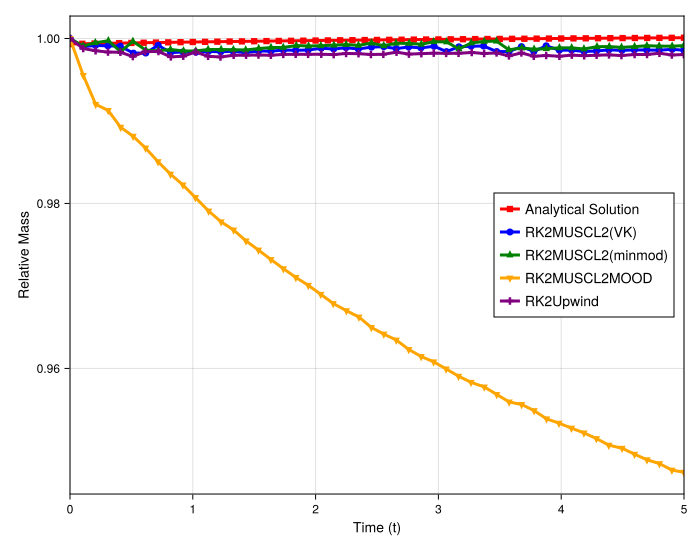
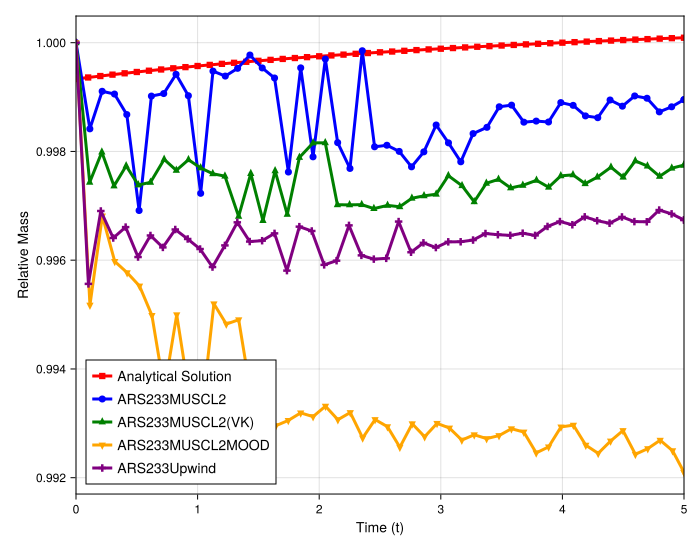
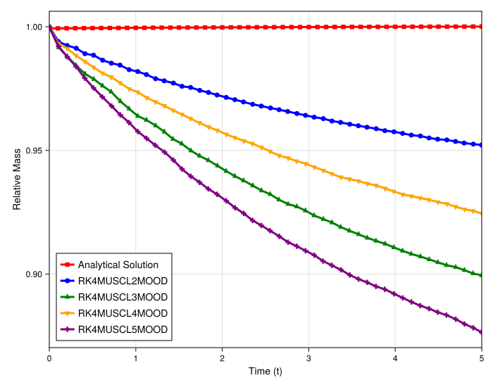

# 1D Burgers' Quantitative Mass Conservation Study (Shock)

## Introduction

This document provides a quantitative analysis of mass conservation for the 1D Burgers' shock problem. The plots show the **Relative Mass** (`M_num(t) / M_ana(t)`), where a value of **1.0 signifies perfect conservation**.

The analysis is in two parts:
1.  A comparison of mass loss between **Direct (RK) solvers** and **IMEX (ARS222) solvers**.
2.  An investigation into how the **order of the MUSCL scheme** (2, 3, 4, 5) affects the conservation of the `MOOD` stabilization.

## Experimental Setup

-   **PDE**: 1D Burgers' (`burgers1d`)
-   **Initial Condition**: Shock (`shock`)
-   **Methods**: `Upwind`, `MUSCL`, `Limiter`, and `MOOD` variants
-   **Timesteppers**: `RK4` (Direct) and `ARS222` (IMEX)

---

## Part 1: Direct (RK) vs. IMEX (ARS222) Solvers

This comparison mirrors the findings from the 2D Burgers' case, confirming the fundamental behavior of the `MOOD` scheme.

### Observations

-   **Standard Methods**: In both plots, the `Upwind`, `MUSCL` (unlimited), and `Limiter` schemes are **nearly conservative**. Their relative mass oscillates symmetrically around the 1.0 line, which is expected behavior for meshless methods that are not strictly conservative by construction.
-   **MOOD (Direct Solver)**: The `RK4MUSCL2MOOD` scheme shows a clear, **systematic non-conservative mass loss**. The relative mass line drops and stays well below 1.0.
-   **MOOD (IMEX Solver)**: The `ARS222MUSCL2MOOD` scheme is also **systematically non-conservative**, but the mass loss is *significantly smaller* than in the direct solver case.

### Analysis

This confirms that the `MOOD` stabilization is the source of the systematic mass loss. The IMEX solver's relaxation/stabilization mechanism **mitigates** this mass loss but does not eliminate it.

---

## Part 2: Analysis of High-Order MOOD Schemes

This plot investigates how the conservation of `MOOD` changes when paired with higher-order `MUSCL` reconstructions.

### Observations

The schemes are clearly grouped by their conservation properties:

1.  **Even vs. Odd Orders**: The **even-order** schemes (`RK4MUSCL2MOOD` and `RK4MUSCL4MOOD`) are **more conservative** (their lines are closer to 1.0) than the **odd-order** schemes (`RK4MUSCL3MOOD` and `RK4MUSCL5MOOD`).
2.  **Low vs. High Orders**: Within those groups, the **lower-order** scheme is more conservative.
    -   `RK4MUSCL2MOOD` (blue) loses the *least* mass.
    -   `RK4MUSCL4MOOD` (orange) is second.
    -   `RK4MUSCL3MOOD` (green) is third.
    -   `RK4MUSCL5MOOD` (purple) loses the *most* mass.

### Analysis

This provides strong evidence for the *cause* of the mass loss. Higher-order (and, interestingly, odd-order) unlimited schemes are known to produce larger, sharper oscillations near discontinuities. Since the `MOOD` logic is designed to detect these oscillations and revert to a simpler scheme, the larger oscillations of the `MUSCL4/5` methods (and `3/5`) are likely triggering this "fallback" mechanism more aggressively.

Because the fallback mechanism is itself non-conservative, **more triggers = more mass loss**. This explains why the methods with the most oscillatory base schemes (`MUSCL5`, `MUSCL3`) suffer from the worst non-conservative behavior.